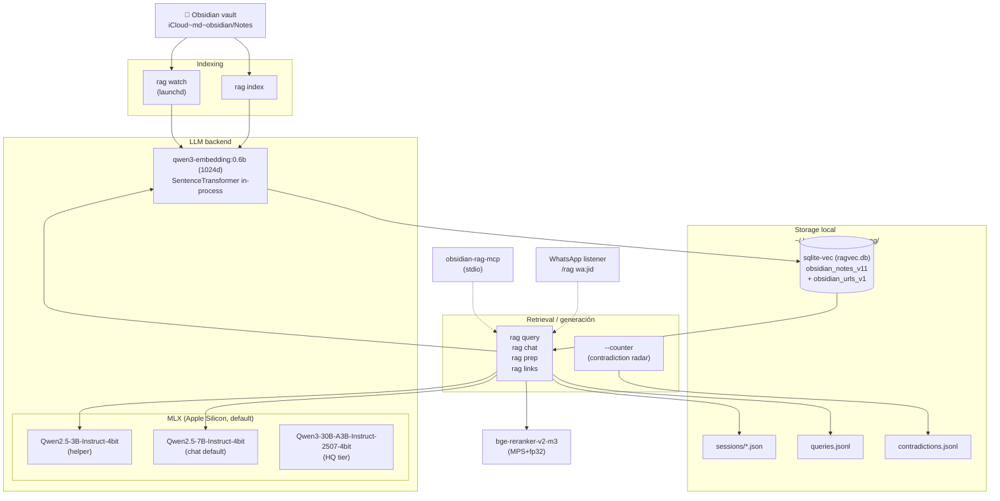
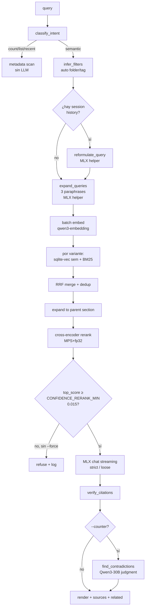
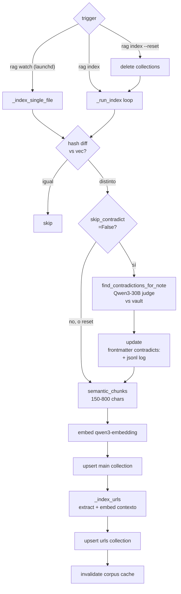
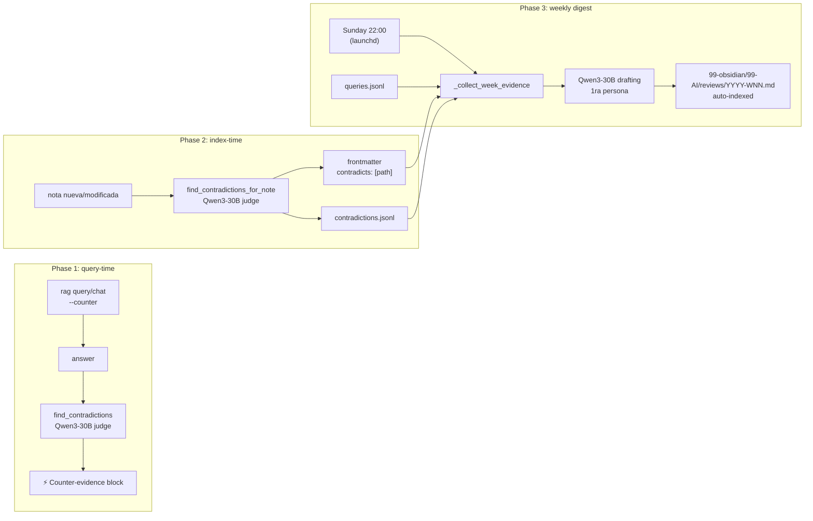
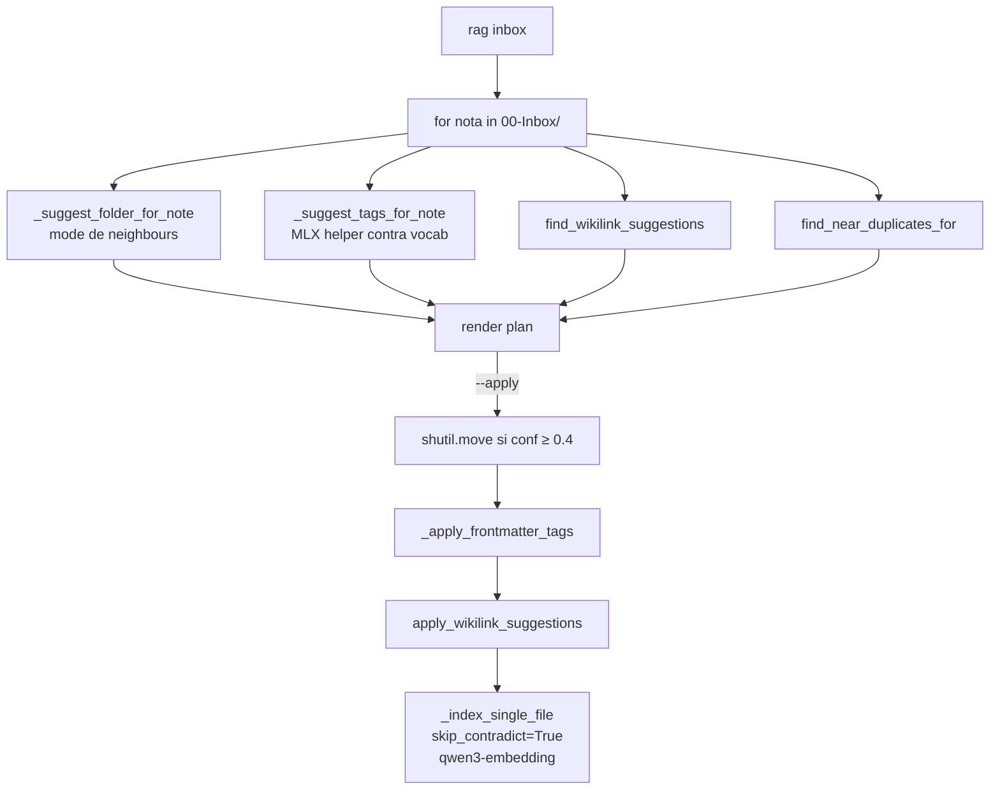

# obsidian-rag

Sistema de búsqueda inteligente para tu vault de Obsidian. Todo corre localmente en tu Mac: usa sqlite-vec para buscar en tus notas, MLX para embeddings y generación, y sentence-transformers para reranking local. No envía nada a la nube, no tiene telemetría.

**¿Qué hace?**
- Busca en tus notas usando lenguaje natural (ej: "qué ideas tengo sobre ikigai")
- Genera respuestas con citas a las notas originales
- Detecta contradicciones entre notas
- Sugiere dónde archivar notas del Inbox
- Envía briefs diarios y resúmenes semanales
- Integra con WhatsApp, Gmail, Calendar, Reminders, Spotify

> **Para detalles técnicos avanzados**, ver [CLAUDE.md](./CLAUDE.md). Este README es la guía práctica: comandos, configuración, troubleshooting — lo que necesitás recordar para usar el sistema día a día.

---

## Tabla de contenidos

1. [Qué es y cómo se compone](#qué-es-y-cómo-se-compone)
2. [Instalación / setup](#instalación--setup)
3. [Storage layout](#storage-layout-dónde-vive-cada-cosa)
4. [Arquitectura: servicios y pipelines](#arquitectura-servicios-y-pipelines)
5. [Comandos — referencia completa](#comandos--referencia-completa)
6. [Multi-vault (`rag vault`)](#multi-vault-rag-vault)
7. [Ambient Agent (co-autor del Inbox)](#ambient-agent-co-autor-del-inbox)
8. [Surface — puentes en el grafo](#surface--puentes-en-el-grafo)
9. [Filing asistido (`rag file`)](#filing-asistido-rag-file)
10. [Configuración (env vars + modelos)](#configuración-env-vars--modelos)
11. [Frontmatter conventions](#frontmatter-conventions)
12. [MCP tools](#mcp-tools)
13. [Automation (launchd)](#automation-launchd)
14. [Módulos de aprendizaje (learning modules)](#módulos-de-aprendizaje-learning-modules)
15. [WhatsApp listener](#whatsapp-listener)
16. [Web UI (dashboard)](#web-ui-dashboard)
17. [Recetas comunes](#recetas-comunes)
18. [Troubleshooting](#troubleshooting)
19. [Findings empíricos clave](#findings-empíricos-clave-no-olvidar)
20. [Suite de tests](#suite-de-tests)

---

## Qué es y cómo se compone

Una herramienta local-first compuesta por varias superficies sobre el mismo core Python:
CLI (`rag`), servidor web/FastAPI, servidor MCP (`obsidian-rag-mcp`), jobs launchd y ETLs de integraciones. El código principal vive en `/Users/fer/repos/rag/rag/`; la web vive en `/Users/fer/repos/rag/web/`.

El proyecto todavía corre mayormente como procesos locales y no como microservicios de red separados. La arquitectura objetivo es partir primero por **servicios lógicos** con contratos chicos y testeables, y recién después evaluar si alguno merece proceso propio. El plan vivo está en [`docs/microservices-plan.md`](./docs/microservices-plan.md).

> **Nota sobre los modelos de IA**: El sistema usa modelos de Apple Silicon (MLX) que corren 100% en tu Mac. Los modelos principales son Qwen2.5-3B (para tareas rápidas), Qwen2.5-7B (para respuestas principales), y Qwen3-30B (para tareas complejas). Todo corre localmente, sin nube. Detalles técnicos en [`docs/mlx-migration.md`](./docs/mlx-migration.md).



---

## Instalación / setup

Quickstart end-to-end (asumiendo macOS + Homebrew + `uv` ya instalado):

```bash
# 1. Verificar modelos MLX descargados (cache HuggingFace)
ls ~/.cache/huggingface/hub/ | grep mlx-community
# Si falta:
huggingface-cli download mlx-community/Qwen2.5-7B-Instruct-4bit

# 2. Instalar el CLI (binarios: rag, obsidian-rag-mcp)
cd /Users/fer/repos/rag
uv tool install --reinstall --editable '.[entities,stt]'

# 3. Primer indexado del vault (10-30 min según tamaño del vault + Mac)
rag index

# 4. Levantar el sistema completo (daemons + servicios)
rag start

# 5. Verificar que el sistema está sano
rag health
launchctl list | grep obsidian-rag
```

**Dependencias del sistema**:
- Modelos MLX descargados (se descargan automáticamente al primer uso)
- Python 3.13 vía [`uv`](https://docs.astral.sh/uv/)
- Para integraciones opcionales (Gmail/Calendar): credenciales OAuth en `~/.gmail-mcp/`
- Para WhatsApp: el bridge `~/whatsapp-listener/` corriendo en `localhost:8080`

**Para correr tests**:
```bash
.venv/bin/python -m pytest tests/ -q             # full suite (~100s)
.venv/bin/python -m pytest tests/test_X.py -q    # un módulo
.venv/bin/python -m pytest tests/test_X.py::test_Y    # un caso
```

**Si algo se rompió durante el setup**: ver [`docs/recovery.md`](./docs/recovery.md) — guía de troubleshooting para los problemas más comunes.

---

## Storage layout (dónde vive cada cosa)

| Path | Qué guarda |
|---|---|
| `~/.local/share/obsidian-rag/ragvec/` | sqlite-vec persistente (archivo `ragvec.db`). Dos collections: `obsidian_notes_v11_<sha8>` (chunks) + `obsidian_urls_v1_<sha8>` (URLs con contexto embebido). Sufijo sha8 por vault. |
| `~/.local/share/obsidian-rag/sessions/<id>.json` | Sesiones conversacionales (1 archivo por sesión) |
| `~/.local/share/obsidian-rag/last_session` | Pointer a la última session id usada (`--continue`/`--resume`) |
| `~/.local/share/obsidian-rag/queries.jsonl` | Log append-only de cada query/chat/links event |
| `~/.local/share/obsidian-rag/contradictions.jsonl` | Log append-only de contradicciones detectadas al indexar |
| `~/.local/share/obsidian-rag/ambient.json` | Config del Ambient Agent: `{jid, enabled}`. Escrito por el listener vía `/enable_ambient`. Configs viejas con `{chat_id, bot_token}` quedan inertes (re-`/enable_ambient` desde WhatsApp). |
| `~/.local/share/obsidian-rag/ambient.jsonl` | Log de eventos del Ambient Agent (wikilinks aplicados, dupes, related, `whatsapp_sent`; líneas pre-migración llevan `telegram_sent`) |
| `~/.local/share/obsidian-rag/ambient_state.jsonl` | Dedup state (`{path, hash, ts}` últimas 500 líneas) para evitar doble-ping al save |
| `~/.local/share/obsidian-rag/surface.jsonl` | Log de puentes propuestos por `rag surface` (pares cercanos-pero-lejanos) |
| `~/.local/share/obsidian-rag/filing.jsonl` | Log de decisiones de `rag file` (propuestas, confirmadas, skip, edit) |
| `~/.local/share/obsidian-rag/filing_batches/<ts>.jsonl` | Batch de un `rag file --apply`: una línea por move, necesario para `--undo` |
| `~/.local/share/obsidian-rag/auto_index_state.json` | Estado del watcher (lo último indexado por `rag watch`) |
| `~/.local/share/obsidian-rag/watch.log` & `.error.log` | Logs del servicio launchd `rag watch` |
| `~/.local/share/obsidian-rag/digest.log` & `.error.log` | Logs del servicio launchd `rag digest` |
| `~/.local/share/obsidian-rag/morning.log` & `.error.log` | Logs del servicio launchd `rag morning` |
| `~/.config/obsidian-rag/vaults.json` | Registry multi-vault (`rag vault add/use/list`). Contiene `{vaults: {name: path}, current: name}`. |
| `~/Library/LaunchAgents/com.fer.obsidian-rag-{watch,digest,morning}.plist` | Plists generados por `rag setup` |
| `~/.local/share/uv/tools/obsidian-rag/` | Tool venv instalado por `uv tool install` |
| `<repo>/.venv/` | Venv local para tests (pytest acá) |
| `<vault>/99-obsidian/99-AI/reviews/YYYY-WNN.md` | Output del weekly digest |
| `<vault>/00-Inbox/YYYY-MM-DD-prep-<slug>.md` | Output de `rag prep --save` |
| `<vault>/00-Inbox/<title>.md` | Output de `/save` desde chat |

**Per-vault namespace**: si seteás `OBSIDIAN_RAG_VAULT=/otra/ruta`, las collections se renombran a `<base>_<sha8>` automáticamente para no compartir índice.

---

## Arquitectura: servicios y pipelines

> Los diagramas viven en [`docs/diagrams/`](./docs/diagrams/) como mermaid (`.mmd`, editable) + SVG renderizado. Los bloques `mermaid` inline abajo son los mismos diagramas — GitHub los renderiza directo. Regenerar SVGs: `cd docs/diagrams && for f in *.mmd; do npx -y @mermaid-js/mermaid-cli -i "$f" -o "${f%.mmd}.svg" -t dark -b transparent; done`.

### Mapa modular actual

| Servicio lógico | Responsabilidad | Módulos principales |
|---|---|---|
| Web Gateway | FastAPI, auth/admin token, SSE, static files, uploads, request validation | `web/server.py`, `web/basic_routes.py`, `web/action_routes.py`, `web/chat_schemas.py`, `web/chat_uploads.py` |
| Chat/Retrieval API | Orquestar intent, retrieve, rerank, postprocess, streaming y sesiones | `rag/__init__.py`, `rag/pipeline_flags.py`, `rag/response_cache.py`, `rag/rendering.py` |
| Indexer | Recorrer vault, chunking, embeddings, URL/wiki/entity indexing, cache de embeddings | `rag/__init__.py`, `rag/vector_store.py`, `rag/contextual_retrieval.py`, `rag/embedding_cache.py`, `rag/index_etl_state.py` |
| Integrations ETL | Importar fuentes externas a notas/index: WhatsApp, Gmail, Calendar, Reminders, Chrome, Drive, GitHub, finanzas | `rag/integrations/**`, `scripts/ingest_*.py` |
| Runtime Scheduler | Jobs frecuentes/nocturnos, supervisor, IPC, health de daemons | `rag/runtime/**`, `rag/plists/**` |
| Telemetry/State | SQLite state, JSONL legacy, behavior, feedback, impressions, logs | `rag/_telemetry_ddl.py`, `rag/runtime/_telemetry.py`, helpers en `rag/__init__.py` |
| Local Model Runtime | MLX chat/embed/rerank/NLI lifecycle y warmups | `rag/llm_backend.py`, `rag/mlx_embed.py`, `rag/mlx_reranker.py`, `rag/mlx_tool_calls.py` |
| WhatsApp Surface | Bridge, contacts, drafts, scheduled sends, voice, memory, search | `rag/integrations/whatsapp/**`, rutas `/api/wa/**` en `web/server.py` |

**Regla para continuar el split:** no convertir nada en proceso separado hasta que funcione primero como módulo Python importable, con contrato explícito y tests focalizados. Si un módulo necesita importar todo `rag/__init__.py` para hacer una tarea simple, todavía no está listo como microservicio.

**Cortes recientes que ya existen:**
- `web/chat_schemas.py`: modelos/validaciones de `ChatRequest` y `ChatAttachment`.
- `web/chat_uploads.py`: sanitización EXIF/HEIC, extracción de texto de uploads y copia al vault.
- `rag/pipeline_flags.py`: flags de adaptive routing, NLI grounding, fast-path lookup y pools por intent.

**Siguiente secuencia recomendada:**
1. Extraer `web/whatsapp_routes.py` desde el bloque `/api/wa/**`, usando un objeto de dependencias para evitar arrastrar globals.
2. Extraer `rag/indexing_service.py` con `_index_single_file`, `_run_index_inner`, `_do_index` y helpers de chunk/hash. El contrato debería aceptar `vault_path`, `collection`, `embed_fn` y `telemetry`.
3. Extraer `rag/retrieval_service.py` con `retrieve`, `multi_retrieve`, `run_chat_turn` y modelos de resultado.
4. Partir `web/static/app.js` por flujo: composer/uploads, SSE chat, sources/rendering, settings y contact commands.
5. Unificar ETLs con contrato `discover -> normalize -> write_notes -> index_delta`.

### System overview — cómo se conectan las piezas



### Interacciones con el LLM backend

> **Stack MLX (Olas 0-8 cerradas 2026-05-06)**: el código activo es 100% MLX. La tabla de abajo conserva los nombres cortos `qwen2.5:Xb` / `command-r` como aliases — bajo `RAG_LLM_BACKEND=mlx` (único disponible), [`rag/llm_backend.py`](./rag/llm_backend.py) los resuelve a sus equivalentes MLX 4bit en runtime. Detalle: [`docs/mlx-migration.md`](./docs/mlx-migration.md).

Cada operación del pipeline va a un modelo específico. El reranker vive en sentence-transformers aparte (MPS+float32, **no fp16** — colapsó en 2 A/Bs).

 <!-- legacy filename, content currently shows the MLX/embedder graph -->

| Operación | Modelo | Vía |
|---|---|---|
| Index embeddings (chunks + URL contexts) | `qwen3-embedding:0.6b` | SentenceTransformer in-process |
| Query embeddings (variantes) | `qwen3-embedding:0.6b` | SentenceTransformer in-process |
| Expand queries (3 paraphrases) | `qwen2.5:3b` (MLX) | `_mlx_chat` |
| Reformulate con session history | `qwen2.5:3b` (MLX) | `_mlx_chat` |
| HyDE (opt-in `--hyde`) | `qwen2.5:3b` (MLX) | `_mlx_chat` |
| Autotag / inbox tag suggestion | `qwen2.5:3b` (MLX) | `_mlx_chat` |
| Answer generation (query + chat) | `qwen2.5:7b` (MLX) | `_chat_stream_dispatch` |
| Contradiction detection (fase 1 + 2) | `command-r` → `Qwen3-30B-A3B` (MLX) | `_mlx_chat` (JSON strict) |
| Weekly digest / morning brief / prep | `command-r` → `Qwen3-30B-A3B` (MLX) | `_mlx_chat` |
| Surface "por qué este puente" | `command-r` → `Qwen3-30B-A3B` (MLX) | `_mlx_chat` |
| Agent loop (`rag do`) | `command-r` → `Qwen3-30B-A3B` (MLX) | `_mlx_chat` tool-calling nativo |
| Cross-encoder rerank | `BAAI/bge-reranker-v2-m3` | sentence-transformers local (**MPS+fp32**, fp16 falla — ver CLAUDE.md invariant) |

Resolver de `resolve_chat_model()`: `RAG_CHAT_MODEL` explícito gana; si no, el primer snapshot MLX disponible en `qwen3:30b-a3b` → `qwen2.5:7b` → aliases compat (`command-r:latest`, `qwen2.5:14b`). Los aliases se resuelven en [`rag/llm_backend.py`](./rag/llm_backend.py).

### Topología de servicios

Launchd + CLIs + bots + MLX + storage — qué corre solo, qué dispara qué, qué escribe dónde.



### Retrieval



### Indexing



### Contradiction Radar (3 fases)



### Inbox triage (composición)



---

## Comandos — referencia completa

### Indexing

| Comando | Función |
|---|---|
| `rag index` | Indexado incremental (hash-based). Detecta cambios y solo re-embebe lo que cambió. Corre check de contradicciones por defecto en notas modificadas. |
| `rag index --reset` | Drop + rebuild ambas collections (notes + urls). **Skip contradicción automático** (sería O(n²) LLM calls). |
| `rag index --no-contradict` | Incremental sin check de contradicciones. |
| `rag watch` | Daemon: re-indexa en cada save del vault (debounce 3s, watchdog). Manejado por launchd vía `rag setup`. |
| `rag watch --debounce 5` | Debounce custom en segundos. |

### Query / chat (retrieval)

| Comando | Función |
|---|---|
| `rag query "<q>"` | Consulta única. Pipeline completo: classify → expand → retrieve → rerank → LLM. |
| `rag query --hyde` | HyDE on. **Cuidado**: con qwen2.5:3b empeora hit@5 (95→90). Activar solo con LLMs grandes. |
| `rag query --no-multi` | Sin multi-query expansion (solo la query original). |
| `rag query --no-auto-filter` | No infiere folder/tag desde la query. |
| `rag query --raw` | Skip LLM; muestra los chunks crudos. |
| `rag query --loose` | Permite prosa externa del LLM (marcada con ⚠). Default es strict. |
| `rag query --force` | Ignora la confidence gate y llama al LLM igual. |
| `rag query --counter` | Contradiction radar query-time: muestra chunks que contradicen la respuesta. |
| `rag query --session <id>` | Guarda + reanuda sesión por id. El WhatsApp listener usa `wa:<jid>`. |
| `rag query --continue` | Atajo a `--session <last_session>`. |
| `rag query --plain` | Salida sin colores/paneles para consumo programático (bots). |
| `rag query --folder X --tag Y -k 8` | Filtros explícitos, k custom. |
| `rag chat` | Chat interactivo. Mismo pipeline pero multi-turn. |
| `rag chat --session/--resume/--counter` | Idem query. |
| `rag chat --precise` | HyDE + reformulación (≈+5s). |

**Intents en chat** (NL detectados antes de tratar como query):
- Reindex: `/reindex [reset]` o NL ("reindexá", "actualizá el vault", "reescaneá las notas")
- Save: `/save [título]` o NL ("guardá esto", "creá una nota llamada X")
- Links: `/links <q>` o NL ("dame el link a X", "documentación de Y", "donde está el url de Z")

### Sesiones conversacionales

| Comando | Función |
|---|---|
| `rag session list [-n 20]` | Lista sesiones recientes (id, turns, modo, fecha, primera query). |
| `rag session show <id>` | Muestra todos los turns de una sesión. |
| `rag session clear <id> [--yes]` | Borra una sesión. |
| `rag session cleanup [--days 30]` | Purga sesiones más viejas que N días por mtime. |

**Schema** (`~/.local/share/obsidian-rag/sessions/<id>.json`):
```json
{
  "id": "...", "created_at": "...", "updated_at": "...", "mode": "chat|query|mcp",
  "turns": [{"ts": "...", "q": "...", "q_reformulated": "...?", "a": "...", "paths": [...], "top_score": 0.42, "contradictions": [...]}]
}
```
Caps: TTL 30 días, 50 turns por sesión, history window 6 messages para reformulación. ID admite `[A-Za-z0-9_.:-]{1,64}`.

### URL finder

| Comando | Función |
|---|---|
| `rag links "<q>"` | URLs ranked por contexto semántico — sin LLM. OSC 8 hyperlinks. |
| `rag links "<q>" -k 20 --folder X --tag Y` | Cap, filtros. |
| `rag links "<q>" --open 3` | Abre la URL del rank 3 en el browser default (macOS `open`). |
| `rag links "<q>" --plain` | Salida plana. |
| `rag links --rebuild` | Re-extrae URLs de todas las notas sin re-embeddar chunks (~1 min). **Auto-corre** la primera vez si la collection está vacía pero el vault está indexado. |

### Wikilink density

| Comando | Función |
|---|---|
| `rag wikilinks suggest` | Dry-run, todo el vault. Lista menciones de títulos sin wikilinkear. |
| `rag wikilinks suggest --note <path>` | Solo una nota. |
| `rag wikilinks suggest --folder X` | Solo bajo este folder. |
| `rag wikilinks suggest --apply` | Escribe los `[[wikilinks]]` y re-indexa. |
| `rag wikilinks suggest --min-len 5 --max-per-note 20 --show 10` | Ajustes. |

Skips: frontmatter, fenced/inline code, existing wikilinks, markdown links, HTML tags. Skipea títulos ambiguos (mismo string → varios paths) y self-links.

### Daily productivity

| Comando | Función |
|---|---|
| `rag capture "<texto>"` | Captura rápida al `00-Inbox/YYYY-MM-DD-HHMM-<slug>.md`. Auto-indexa. |
| `rag capture --stdin --tag voice --source whatsapp-voice` | Leer texto de stdin. Útil para voice transcripts. |
| `rag morning [--dry-run] [--date Y-M-D] [--lookback-hours 36]` | Brief diario: ayer + foco hoy + inbox + contradicciones nuevas + queries low-conf. Usa HQ tier MLX, 120-280 palabras. Auto Mon-Fri 7:00. |
| `rag dead [--min-age-days 365] [--query-window-days 180] [--folder X] [--plain]` | Candidatos a archivar: 0 outlinks + 0 backlinks + no recuperada + vieja. Usa frontmatter `created:` si existe (iCloud-safe). |
| `rag dupes [--threshold 0.85] [--folder X] [--limit 50] [--plain]` | Pares de notas con centroides similares. Numpy. <1s sobre 521 notas. |
| `rag inbox [--folder 00-Inbox] [--apply]` | Triage cada nota: folder destino + tags + wikilinks + duplicados. `--apply` mueve + escribe + reindexa (si confianza ≥ 0.4). |
| `rag inbox --no-folder/--no-tags/--no-wikilinks` | Skip individual signals. |
| `rag inbox --max-tags 5 --limit 20 --folder-min-conf 0.4` | Tunings. |
| `rag prep "<topic>"` | Brief de contexto sobre persona/proyecto/tema. HQ tier MLX, 350-550 palabras estructurado. |
| `rag prep "<topic>" --save` | Guarda a `00-Inbox/YYYY-MM-DD-prep-<slug>.md` y auto-indexa. |
| `rag prep "<topic>" --folder X -k 8 --no-urls --no-related --plain` | Filtros. |

### Agent loop

| Comando | Función |
|---|---|
| `rag do "<instrucción>"` | Tool-calling agent con HQ tier MLX. Tools: search, read_note, list_notes, propose_write. **Writes son dry-run** (acumulados en `_AGENT_PENDING_WRITES`, confirmás cada uno al final). |
| `rag do "..." --yes --max-iterations 12` | Skip confirmación + cap de iteraciones. |

### Multi-vault

| Comando | Función |
|---|---|
| `rag vault list` | Lista vaults registrados; marca el activo con `→`. |
| `rag vault add <name> <path>` | Registra un vault con un alias. |
| `rag vault use <name>` | Cambia el vault activo (persistente en `vaults.json`). |
| `rag vault current` | Muestra cuál se va a usar y por qué (env var / registry / default). |
| `rag vault remove <name>` | Quita del registry (no borra chunks del vector store). |

### Ambient Agent

| Comando | Función |
|---|---|
| `rag ambient status` | ¿Enabled? ¿Con qué `chat_id`? |
| `rag ambient disable` | Flag `enabled=false` (deja config intacta, re-habilitás desde el bot). |
| `rag ambient test <path>` | Dispara el hook sobre una nota sin tener que guardar en Obsidian (debugging). |
| `rag ambient log [-n N]` | Tail de `ambient.jsonl`. |

### Surface (puentes en el grafo)

| Comando | Función |
|---|---|
| `rag surface` | Propone pares cercanos semánticamente pero lejanos en el grafo. Default: cosine ≥0.78, hops ≥3, top 5. |
| `rag surface --sim-threshold 0.8 --min-hops 4 --top 10` | Estrictar. |
| `rag surface --skip-young-days 7` | Ignora notas más nuevas que N días (siguen cambiando). |
| `rag surface --no-llm --plain` | Sin "por qué" generado por el LLM (más rápido). |

### Filing asistido

| Comando | Función |
|---|---|
| `rag file` | Dry-run sobre `00-Inbox/`: propone destino PARA + upward-link, loguea a `filing.jsonl`, no mueve. |
| `rag file <path>` | Dry-run de una sola nota. |
| `rag file --apply` | Interactivo: `y/n/e(edit)/s(skip)/q(quit)` por nota. Escribe batch a `filing_batches/<ts>.jsonl`. |
| `rag file --undo` | Revierte el último batch aplicado. |
| `rag file --one` | Solo la nota más vieja del Inbox. |
| `rag file --folder X --limit 20 -k 8` | Scope, cap, k de vecinos. |

### Eval / observabilidad

| Comando | Función |
|---|---|
| `rag health [--since 24] [--as-json]` | **Dashboard unificado de salud** — snapshot de 5s con corpus size + latencia P50/P95 de queries recientes + cache hit rate + feedback stats + progreso hacia gate de fine-tune + estado de calibración + features opt-in activos + training signal flywheel (CTR + orphan opens). Pensado para correr **antes de cualquier debug**. Para deep-dives usar los comandos específicos abajo. |
| `rag dashboard [--days 30]` | **Analytics de queries** — métricas del pipeline sobre `queries.jsonl`: distribución de intents, hit@k por intent, latencia breakdown, paths más consultados, queries low-confidence agrupadas. Ventana default 30 días. |
| `rag stats` | Estado del índice: chunks, URLs, vault path, collections, modelos resueltos (chat / helper / embed / reranker), pipeline flags activos. |
| `rag eval` | Corre `queries.yaml` (singles + chains). Imprime hit@k, MRR, recall@k, chain_success. |
| `rag eval --hyde --no-multi -k 10 --file otro.yaml` | Variantes. |
| `rag log [-n 20]` | Tail últimas N queries del jsonl. |
| `rag log --low-confidence` | Filtra queries con `top_score ≤ CONFIDENCE_RERANK_MIN`. Útil para gap detection. |
| `rag log --silent-errors [--summary]` | Tail de las excepciones capturadas por `_silent_log` (subsistemas secundarios). |
| `rag gaps [--threshold 0.015] [--min-count 2] [--days 60]` | Cluster low-confidence queries del log → temas que el vault no responde. |
| `rag timeline [--query Q] [--tag T] [--folder F] [--limit N]` | Notas ordenadas por mtime. |
| `rag graph <note-title> [--depth 2] [--output file.html]` | Grafo local en torno a una nota. |
| `rag autotag <path> [--apply] [--max-tags 6]` | Sugiere tags del vocabulario. |
| `rag digest [--week YYYY-WNN] [--days 7] [--dry-run]` | Weekly narrative digest. Auto-corre los domingos 22:00 vía launchd. |
| `rag maintenance [--dry-run] [--as-json]` | DB compact + chat-uploads TTL cleanup (default 30 días, override via `RAG_CHAT_UPLOADS_TTL_DAYS`) + filing batches prune + tmp file cleanup + URL orphans GC. Auto-corre weekly vía launchd. |

### Automation

| Comando | Función |
|---|---|
| `rag start [--all] [--without-rag-net] [--no-index] [-y] [--dry-run]` | **Levanta TODO el sistema** y reindexa al último minuto de uso. Simétrico a `rag stop`. Orden: (1) `rag setup` regenera + carga los 35 `obsidian-rag-*` managed; (2) opcionalmente bootstrap-ea daemons externos (RagNet `whatsapp-*` default ON, qdrant default OFF); (3) corre `rag index` incremental para capturar cambios de archivos editados desde el último tick del watcher (cubre el gap si la Mac estuvo dormida). Idempotente. |
| `rag setup` | Instala los 16 launchd plists `com.fer.obsidian-rag-*` (watch, web, digest, morning, today, anticipate, ingest-{whatsapp,gmail,calendar,reminders}, wa-tasks, reminder-wa-push, **wa-scheduled-send**, maintenance, calibrate, auto-harvest, online-tune, …). Idempotente — re-correr recarga. Subset de `rag start` (no incluye externos ni catch-up). Ver tabla completa en [§Automation (launchd)](#automation-launchd). |
| `rag setup --remove` | Desinstala todos los servicios obsidian-rag-* (borra plists del disco). |
| `rag stop [--all] [--without-rag-net] [--with-qdrant] [-y] [--dry-run]` | **Para TODO el sistema** en un solo comando. Inverso de `rag start`. Orden: watchdog/wake-hook primero (para que no rebootstrap-een), después el resto de obsidian-rag-*, opcional RagNet (default ON), opcional qdrant (default OFF — legacy, memo es el standard actual). |
| `rag wa-scheduled-send [--dry-run] [--late-threshold-min 5] [--max-retries 5] [--max-per-run 20]` | Worker manual del envío de mensajes de WhatsApp programados. Lo dispara automáticamente el plist `com.fer.obsidian-rag-wa-scheduled-send` cada 5 min, pero podés correrlo a mano para debug — `--dry-run` calcula sin enviar ni mover status. Idempotente: cada row se mueve `pending`→`sent`/`sent_late`/`failed` en una sola transacción. |
| `rag remind-wa [--dry-run] [--window-min 5] [--max-overdue-min 1440]` | Worker manual del push de Apple Reminders próximos a vencer al JID ambient. Cron equivalente: `com.fer.obsidian-rag-reminder-wa-push` cada 5 min. Idempotente vía `rag_reminder_wa_pushed`. |
| `rag ambient {status,disable,test,log}` | Manage del ambient hook (ver [§Ambient Agent](#ambient-agent-co-autor-del-inbox)). |

```bash
# Inspección de los servicios
launchctl list | grep obsidian-rag
tail -f ~/.local/share/obsidian-rag/{watch,web,digest,morning,wa-scheduled-send}.log

# Forzar un tick manual de un servicio
launchctl kickstart -k gui/$(id -u)/com.fer.obsidian-rag-wa-scheduled-send
```

### MCP server

```bash
obsidian-rag-mcp   # se lanza por Claude Code on demand, no manualmente
```

---

## Multi-vault (`rag vault`)

Registry en `~/.config/obsidian-rag/vaults.json` con `{vaults: {name: path}, current: name}`. Cada vault obtiene su propia colección sqlite-vec automáticamente — namespacing por `sha256(VAULT_PATH)[:8]` sobre `_COLLECTION_BASE`. Switchear no contamina datos.

**Precedencia** al resolver vault activo:

1. `OBSIDIAN_RAG_VAULT` env var — override por invocación, gana siempre.
2. `rag vault use <name>` — el `current` del registry, persistente.
3. Default iCloud `Notes` — legacy single-vault.

**Gotcha conocido**: `queries.yaml` está calibrado contra el vocabulario de un vault concreto. Si corrés `rag eval` contra otro vault, el hit@5 va a parecer catastrófico — no es regresión del retriever, es data mismatch. Para evaluar otro vault hace falta su propio golden set.

```bash
rag vault add home "~/Library/Mobile Documents/iCloud~md~obsidian/Documents/Notes"
rag vault add work "~/Library/Mobile Documents/iCloud~md~obsidian/Documents/obsidian-work"
rag vault use work      # persistente
rag vault current       # → work (registry)
OBSIDIAN_RAG_VAULT=/tmp/tests rag index   # override temporal, no toca el registry
```

---

## Ambient Agent (co-autor del Inbox)

Hook en `_index_single_file` que dispara sobre saves en `00-Inbox/` cuando el hash cambió. **Composición pura de primitivas existentes, sin LLM extra** (~0 cost además del indexing ya pagado).

- **Auto-aplica**: `find_wikilink_suggestions` + `apply_wikilink_suggestions`. El suggester ya es conservador (skip ambigüos, short titles, self-links).
- **Notifica vía WhatsApp** al `jid` configurado: near-duplicates (cosine ≥0.85), related notes (graph/tags), wikilinks aplicados. Mensaje compacto con `[[wikilinks]]` clickeables en Obsidian.
- **Silent por default**: si no hay findings interesantes, no manda nada.

**Skip rules** (evaluadas en orden):

| Condición | Efecto |
|---|---|
| Nota fuera de `00-Inbox/` | no-op |
| Sin config (no se hizo `/enable_ambient`) | no-op |
| Frontmatter `ambient: skip` | opt-out por nota |
| `type: morning-brief \| weekly-digest \| prep` | skip (system-generated) |
| Mismo `{path, hash}` analizado en los últimos 5 min | skip (evita doble ping) |

**Config** en `~/.local/share/obsidian-rag/ambient.json`. Habilitación vía `/enable_ambient` en el listener de WhatsApp (`~/whatsapp-listener/listener.ts`, grupo "RagNet" — JID `120363426178035051@g.us`). El listener toma el JID del config local; no hay token externo. rag.py SOLO lee y POST a `http://localhost:8080/api/send` del `whatsapp-bridge` (urllib); no depende del listener estando up: si el listener muere el análisis sigue y queda en `ambient.jsonl`. Si el bridge muere se pierde el ping. Backwards-compat: configs viejas con `{chat_id, bot_token}` quedan inertes — borrar `ambient.json` y re-`/enable_ambient`.

```bash
rag ambient status
rag ambient test 00-Inbox/idea-nueva.md     # dispara sin guardar en Obsidian
rag ambient log -n 20
rag ambient disable                          # deja config, flag enabled=false
```

---

## Surface — puentes en el grafo

Detecta pares de notas cercanas en significado (centroides con cosine ≥ `--sim-threshold`) pero lejanas en el grafo (distancia ≥ `--min-hops`). Son los "puentes no hechos": ideas que viven en folders distintos sin cruce de wikilinks y podrían densificar el conocimiento.

Pipeline:

1. Construye la matriz de centroides (mean de embeddings por nota).
2. Calcula cosine pairwise (`arr @ arr.T`), enmascara lower triangle.
3. Calcula distancias en el grafo (BFS sobre wikilinks + backlinks).
4. Filtra pares con `cosine ≥ threshold AND hops ≥ min_hops AND edad ≥ skip_young_days`.
5. Para cada par, opcional: el HQ tier MLX genera una línea de "por qué este puente importa".
6. Loguea a `surface.jsonl`.

**Uso típico**: cron nocturno antes del morning brief, o manual cuando se quiere densificar el grafo después de indexar mucho contenido nuevo.

---

## Filing asistido (`rag file`)

Para cada nota del Inbox propone:

- **Destino PARA**: sugiere un folder bajo `01-Projects/02-Areas/03-Resources/04-Archive` usando neighbours semánticos (mode de sus folders, excluyendo Inbox-style prefixes).
- **Upward-links**: wikilinks hacia notas-hub/MOC relacionadas para que el move mantenga conectividad.

**Contrato de seguridad**:

- Sin flags → dry-run: propone y loguea a `filing.jsonl`, no mueve nada.
- `--apply` → interactivo, prompts por nota: `y/n/e(edit)/s(skip)/q(quit)`. Cada move se persiste en `filing_batches/<ts>.jsonl`.
- `--undo` → lee el último batch y revierte atómicamente (el archivo vuelve al path original).
- `--one` → solo la nota más vieja; ideal para runs incrementales.

Complementa a `rag inbox`: `inbox` optimiza para "tag + wikilink + dedup + auto-move" sobre volumen; `file` optimiza para "decidir bien el destino PARA" sobre cada nota con confirmación humana.

---

## Configuración (env vars + modelos)

> **Referencia completa de env vars**: [`docs/env-vars.md`](./docs/env-vars.md) — ~95 variables agrupadas por categoría (Core, Modelos, Embedding, Retrieval, Cache, Ambient, OCR, NLI, Telemetry, WhatsApp, Privacy), con default + path:line + descripción. Los recientes del audit 2026-04-25 (`RAG_RERANK_FASTPATH_DIST`, `RAG_AMBIENT_DISABLED`, `RAG_CHAT_UPLOADS_TTL_DAYS`, `RAG_OCR_HISTORICAL_MAX_DAYS`, `RAG_SSE_MAX_PER_IP`, `RAG_CROSS_SOURCE_DEDUP_THRESHOLD`) están destacados al tope. Para guía orientada a usuarios (cuándo tocar qué) ver [`docs/variables-entorno.md`](./docs/variables-entorno.md).

Las **3 más críticas** que casi siempre vas a querer setear:

| Env var | Default | Función |
|---|---|---|
| `OBSIDIAN_RAG_VAULT` | iCloud Notes | Override del vault path. Las collections se namespace con sha8 del path. |
| `RAG_LLM_KEEP_ALIVE` | `-1` (forever) | kwarg `keep_alive` propagado al backend MLX. No-op en MLX (el backend tiene LRU + idle-unload watchdog propio), preservado por compat de firma. Acepta int o duration string ("30m"). Compat alias: `OLLAMA_KEEP_ALIVE`. |
| `HF_HUB_OFFLINE` / `TRANSFORMERS_OFFLINE` | `1` | Reranker se carga del caché local. |

**Stack de modelos** (definidos al tope de `rag/__init__.py` — nombres lógicos; backend MLX los resuelve a equivalentes 4bit en runtime):

| Rol | Modelo lógico | Resuelto a (default `RAG_LLM_BACKEND=mlx`) |
|---|---|---|
| Chat (answers + contradiction judgment + prep + digest) | `qwen2.5:7b` (default) / `qwen3:30b-a3b` o aliases compat `command-r`, `qwen2.5:14b` (HQ tier) | [`Qwen2.5-7B-Instruct-4bit`](https://huggingface.co/mlx-community/Qwen2.5-7B-Instruct-4bit) / `mlx-community/Qwen3-30B-A3B-Instruct-2507-4bit-DWQ` |
| Helper (paraphrase, HyDE, history reformulation, autotag) | `qwen2.5:3b` | [`Qwen2.5-3B-Instruct-4bit`](https://huggingface.co/mlx-community/Qwen2.5-3B-Instruct-4bit) |
| Embeddings | `qwen3-embedding:0.6b` (multilingual, 1024d) | MLX in-process via `rag.mlx_embed.MLXEmbedder` |
| Reranker | `BAAI/bge-reranker-v2-m3` | sentence-transformers in-process, `device=mps`+`float32` |

**Decoding** (deterministic — esto es retrieval, no creative writing):

```python
CHAT_OPTIONS   = {"temperature": 0, "top_p": 1, "seed": 42, "num_ctx": 4096, "num_predict": 768}
HELPER_OPTIONS = {"temperature": 0, "top_p": 1, "seed": 42, "num_ctx": 1024, "num_predict": 128}
```

---

## Frontmatter conventions

| Key | Quién la escribe | Para qué |
|---|---|---|
| `tags: [a, b, c]` | manual / `rag autotag` / `rag inbox --apply` | Filtros + autotag vocab |
| `related: '[[note-X]]', ...` | `save_note` (chat `/save`) | Indexed como signal extra |
| `contradicts: [vault-path, ...]` | Phase 2 contradiction radar (auto al indexar) | Surfacing en Obsidian/dataview + input al weekly digest |
| `area: ...` | manual (campo `FM_SEARCHABLE_FIELDS`) | Indexado en metadata |
| `cancion`, `familia`, `estado`, `periodo`, `created`, `modified` | manual | Idem (otros searchable fields) |
| `type: prep`, `topic: ...`, `sources: [[[X]]]`, `tags: [prep]` | `rag prep --save` | Marca briefs de prep |
| `tags: [review, weekly-digest]`, `week: YYYY-WNN` | `rag digest` | Marca digests semanales |
| `transcript-source: voice` (planeado) | listener de WhatsApp con voice notes | Marca notas dictadas por voz |

---

## MCP tools

Expuestos por `obsidian-rag-mcp` vía stdio. Registro en `~/.claude.json` (Claude Code los lanza on demand).

| Tool | Args | Devuelve |
|---|---|---|
| `rag_query` | `question, k=5, folder?, tag?, multi_query=True, session_id?` | Lista de chunks `{note, path, folder, tags, score, content}` |
| `rag_links` | `query, k=5, folder?, tag?` | Lista de URLs `{url, anchor, path, note, line, context, score}` |
| `rag_read_note` | `path` | Contenido completo del archivo (vault-relative path validado) |
| `rag_list_notes` | `folder?, tag?, limit=100` | Lista de notas `{note, path, folder, tags}` |
| `rag_stats` | — | `{chunks, collection, embed_model, reranker, vault_path}` |

---

## Automation (launchd)

`rag setup` instala 16 servicios launchd que cubren indexing continuo, briefs diarios, ingesta cross-source, ambient hooks, fine-tuning offline y workers de WhatsApp. Idempotente — re-correr recarga.

| Label | Comando | Trigger | Logs |
|---|---|---|---|
| `com.fer.obsidian-rag-watch` | `rag watch` | RunAtLoad + KeepAlive | `~/.local/share/obsidian-rag/watch.{log,error.log}` |
| `com.fer.obsidian-rag-serve` | `rag serve` | RunAtLoad + KeepAlive | `~/.local/share/obsidian-rag/serve.{log,error.log}` |
| `com.fer.obsidian-rag-web` | `rag web` (FastAPI 8765) | RunAtLoad + KeepAlive | `~/.local/share/obsidian-rag/web.{log,error.log}` |
| `com.fer.obsidian-rag-digest` | `rag digest` | StartCalendarInterval `domingo 22:00 local` | `~/.local/share/obsidian-rag/digest.{log,error.log}` |
| `com.fer.obsidian-rag-morning` | `rag morning` | StartCalendarInterval `lun-vie 07:00 local` | `~/.local/share/obsidian-rag/morning.{log,error.log}` |
| `com.fer.obsidian-rag-today` | `rag today` | `lun-dom 21:00 local` | `~/.local/share/obsidian-rag/today.{log,error.log}` |
| `com.fer.obsidian-rag-wake-up` | wake-up brief | calendar interval | `~/.local/share/obsidian-rag/wake-up.{log,error.log}` |
| `com.fer.obsidian-rag-anticipate` | `rag anticipate` (anticipatory agent) | calendar interval | `~/.local/share/obsidian-rag/anticipate.{log,error.log}` |
| `com.fer.obsidian-rag-emergent` | detector de emergent topics | nightly | `~/.local/share/obsidian-rag/emergent.{log,error.log}` |
| `com.fer.obsidian-rag-patterns` | mining de patrones de routing | nightly | `~/.local/share/obsidian-rag/patterns.{log,error.log}` |
| `com.fer.obsidian-rag-archive` | archive sweep | weekly | `~/.local/share/obsidian-rag/archive.{log,error.log}` |
| `com.fer.obsidian-rag-consolidate` | consolidate conversations | weekly | `~/.local/share/obsidian-rag/consolidate.{log,error.log}` |
| `com.fer.obsidian-rag-maintenance` | `rag maintenance` (DB compact + chat-uploads TTL + filing batches prune) | weekly | `~/.local/share/obsidian-rag/maintenance.{log,error.log}` |
| `com.fer.obsidian-rag-calibrate` | `scripts/calibrate_thresholds.py` | nightly | `~/.local/share/obsidian-rag/calibrate.{log,error.log}` |
| `com.fer.obsidian-rag-auto-harvest` | LLM-as-judge harvest de queries low-conf | `03:30 local` | `~/.local/share/obsidian-rag/auto-harvest.{log,error.log}` |
| `com.fer.obsidian-rag-online-tune` | online tune del reranker | nightly | `~/.local/share/obsidian-rag/online-tune.{log,error.log}` |
| `com.fer.obsidian-rag-ingest-whatsapp` | ingesta WhatsApp via bridge | StartInterval | `~/.local/share/obsidian-rag/ingest-whatsapp.{log,error.log}` |
| `com.fer.obsidian-rag-ingest-gmail` | ingesta Gmail via OAuth | StartInterval | `~/.local/share/obsidian-rag/ingest-gmail.{log,error.log}` |
| `com.fer.obsidian-rag-ingest-calendar` | ingesta Calendar via OAuth | StartInterval | `~/.local/share/obsidian-rag/ingest-calendar.{log,error.log}` |
| `com.fer.obsidian-rag-ingest-reminders` | ingesta Reminders local (EventKit) | StartInterval | `~/.local/share/obsidian-rag/ingest-reminders.{log,error.log}` |
| `com.fer.obsidian-rag-wa-tasks` | extracción de action items desde WhatsApp | `*/30min` | `~/.local/share/obsidian-rag/wa-tasks.{log,error.log}` |
| `com.fer.obsidian-rag-reminder-wa-push` | push de reminders próximos al vencer al JID ambient | `*/5min` | `~/.local/share/obsidian-rag/reminder-wa-push.{log,error.log}` |
| `com.fer.obsidian-rag-wa-scheduled-send` | **worker de WhatsApp programados** — pickea rows `pending` con `scheduled_for_utc <= now` y los envía al bridge; idempotente (`pending`→`sent`/`sent_late`/`failed` en una sola transacción); tras 5 reintentos consecutivos fallidos pasa a `failed` | `*/5min` | `~/.local/share/obsidian-rag/wa-scheduled-send.{log,error.log}` |

**Flujo completo de WhatsApp programado** (end-to-end):

1. El user agenda un mensaje (UI web `/scheduled` o endpoint `/api/whatsapp/schedule`) → row insertada en `rag_wa_scheduled_messages` con `status='pending'`, `scheduled_for_utc`, `contact_jid`, `message_text`.
2. El daemon `com.fer.obsidian-rag-wa-scheduled-send` corre cada 5 min y ejecuta `rag wa-scheduled-send`. Internamente: SELECT rows con `status='pending' AND scheduled_for_utc <= now()`, capadas a `--max-per-run=20`.
3. Por cada row pickeada → POST al WhatsApp bridge (`localhost:8080/api/send`) con el body. Si OK: marca `sent` (o `sent_late` si el delta `now - scheduled_for` supera `--late-threshold-min=5`). Si falla: incrementa `attempt_count`, queda `pending`. Tras `--max-retries=5` consecutivos pasa a `failed` y deja de pickearse.
4. El cuerpo del mensaje **NUNCA se persiste en logs** (privacidad) — solo metadata operativa (`id`, `delta_minutes`, `attempt_count`).
5. El `rag today` brief incluye un widget "WhatsApp pendientes hoy" que destaca rows que quedaron `pending` cuando ya deberían haber salido — señal de que el worker no está corriendo. Ver [recovery.md §2](./docs/recovery.md#2-el-daemon-wa-scheduled-send-no-está-enviando-mensajes-programados) para el fix.

```bash
rag start                      # levanta TODO el sistema + reindex al último minuto (RagNet incluido)
rag start --all                # idem + qdrant
rag start --no-index -y        # solo bootstrap, sin catch-up index
rag start --dry-run            # mostrar qué levantaría sin ejecutar

rag stop                       # para TODO en un solo comando (inverso de rag start)
rag stop --all -y              # incluye qdrant + sin confirmación

rag setup                      # subset de rag start: install/recarga managed (los 35 servicios)
rag setup --remove             # uninstall
launchctl list | grep obsidian-rag
launchctl unload ~/Library/LaunchAgents/com.fer.obsidian-rag-watch.plist
launchctl load   ~/Library/LaunchAgents/com.fer.obsidian-rag-watch.plist
```

**Tunnel público (opcional)**: si querés exponer el web server vía `cloudflared`, los plists `com.fer.obsidian-rag-cloudflare-tunnel` + `com.fer.obsidian-rag-cloudflare-tunnel-watcher` se manejan aparte ([CLAUDE.md §Cloudflare tunnel](./CLAUDE.md)). Para cortar la exposición sin desinstalar, ver [recovery.md §4](./docs/recovery.md#4-el-cloudflare-tunnel-está-corriendo-y-no-querés-exposición-pública).

---

## Recetas comunes

### Hacer una pregunta estricta sin alucinaciones
```bash
rag query "qué dice X"                       # default strict, refuse si confidence baja
rag query "qué dice X" --counter             # + counter-evidence
```

### Conversar con seguimiento (pronombres absorben contexto)
```bash
rag chat --resume                            # reanuda última sesión
rag query --continue "y eso otro?"           # one-shot follow-up
```

### Buscar el link literal (no prosa)
```bash
rag links "documentación de claude code"
rag links "ollama" --open 1
```

### Triar el Inbox semanalmente
```bash
rag inbox                                    # dry-run primero
rag inbox --apply                            # mueve + taggea + linkifica
```

### Preparar para una llamada / sesión
```bash
rag prep "Maria coaching liderazgo" --save
# → ~/Vault/00-Inbox/2026-04-15-prep-maria-coaching-liderazgo.md
```

### Captura rápida desde donde sea
```bash
rag capture "idea suelta sobre X"              # CLI
echo "transcript largo" | rag capture --stdin  # pipe
# O desde WhatsApp (grupo RagNet): /note <texto>, o voice note → captura automática
```

### Morning brief a mano
```bash
rag morning --dry-run                   # ver primero
rag morning                             # escribe 99-obsidian/99-AI/reviews/YYYY-MM-DD.md
# Auto-fires lun-vie 7am vía launchd (rag setup)
```

### Encontrar notas para archivar
```bash
rag dead --min-age-days 365 --query-window-days 180
rag dead --folder 03-Resources --min-age-days 30
```

### Densificar el grafo de Obsidian
```bash
rag wikilinks suggest --folder 02-Areas/Coaching        # dry-run
rag wikilinks suggest --folder 02-Areas/Coaching --apply
```

### Detectar duplicados acumulados
```bash
rag dupes --threshold 0.90 --limit 20
```

### Agente con tools (multi-step)
```bash
rag do "listame qué notas tengo sobre ikigai y proponé un índice"
# → llama list_notes + propose_write, te pide confirmación al final
```

### Forzar regeneración del weekly digest
```bash
rag digest --week 2026-W15
```

### Investigar un fallo de retrieval
```bash
rag log --low-confidence                     # qué queries gatearon
rag query "<la query>" --raw                 # ver chunks crudos
rag query "<la query>" --force --loose       # llamar LLM igual con ⚠
rag eval                                     # baseline contra queries.yaml
```

### Bumpar schema de la collection
1. Editar `_COLLECTION_BASE` (ej. `obsidian_notes_v8`) en `rag.py`.
2. `uv tool install --reinstall --editable '.[entities,stt]'` (extras explícitos para no perder gliner+whisper en el reinstall).
3. `rag index --reset` → drop ambas collections + reindex.
4. (Opcional) borrar collections viejas: `rag.get_db()` se construye on demand, las viejas quedan huérfanas en `~/.local/share/obsidian-rag/ragvec/ragvec.db` (tablas `vec_*_<hash>` / `meta_*_<hash>` con sufijo previo) — se pueden inspeccionar con `sqlite3 ragvec.db ".tables"` y dropear manualmente, o ignorar.

### Migrar a otro vault temporalmente
```bash
OBSIDIAN_RAG_VAULT=/otro/vault rag index    # crea collection nueva con sha8 suffix
OBSIDIAN_RAG_VAULT=/otro/vault rag chat
```

### Usar dos vaults en paralelo (persistente)
```bash
rag vault add home "~/Library/Mobile Documents/iCloud~md~obsidian/Documents/Notes"
rag vault add work "~/Library/Mobile Documents/iCloud~md~obsidian/Documents/obsidian-work"
rag vault use work
rag index              # indexa el vault work en su propia collection
rag vault use home
rag eval               # ahora corre contra home (cuyo golden set sí calibrado)
```

### Activar el Ambient Agent
```bash
# Desde WhatsApp (grupo RagNet, listener corriendo):
/enable_ambient        # guarda jid en ~/.local/share/obsidian-rag/ambient.json
# A partir de acá, cada save en 00-Inbox/ dispara el análisis y puede pingear.

rag ambient status     # confirmá que quedó habilitado
rag ambient test 00-Inbox/prueba.md    # dry-run sin tocar Obsidian
```

### Filing supervisado del Inbox
```bash
rag file                    # dry-run, ver qué propone
rag file --apply --one      # la nota más vieja, con confirmación
rag file --undo             # revertir el último batch si algo salió mal
```

### Buscar puentes no hechos
```bash
rag surface                            # dry-run, top 5 puentes (≥0.78 cosine, ≥3 hops)
rag surface --sim-threshold 0.82 --top 10 --no-llm   # más estricto y sin generar "por qué"
```

---

## Módulos de aprendizaje (learning modules)

El sistema tiene varios módulos que aprenden de tu uso y mejoran con el tiempo:

### Anticipatory Agent (`rag_anticipate/`)

Agente proactivo que sugiere tareas basadas en patrones en tu vault. Corre como daemon y genera candidates con diferentes signals:

- **Calendar**: detecta eventos próximos y genera briefs de preparación
- **Echo**: detecta notas repetidas o similares que podrían necesitar consolidación
- **Commitment**: detecta compromisos en notas y genera recordatorios
- **Screen Time**: monitorea uso de apps y genera alertas de digital wellbeing
- **Voice**: procesa notas de voz y extrae action items

Los candidates se muestran en el dashboard y se pueden enviar a WhatsApp. El sistema aprende de tu feedback (thumbs up/down) para ajustar los pesos de cada signal.



### Implicit Learning (`rag_implicit_learning/`)

Aprendizaje implícito de patrones de uso sin intervención explícita:

- **Auto-rollback**: detecta cuando una query falla y ajusta parámetros automáticamente
- **Corrective paths**: aprende qué correcciones funcionan para ciertos tipos de queries
- **LLM judge ensemble**: usa múltiples modelos para juzgar la calidad de respuestas
- **Requery detection**: detecta cuando re-hacés la misma query con diferente phrasing
- **Reward shaping**: ajusta el reward signal para el learning loop
- **Session outcome**: aprende qué sesiones fueron útiles vs frustrantes



### Ranker Learning (`rag_ranker_lgbm/`)

Entrena un modelo LightGBM para rerank chunks basándose en features de tu vault. Aprende qué tipo de contenido es más relevante para tus queries específicas.

### Routing Learning (`rag_routing_learning/`)

Aprende qué tipo de queries deberían ir a qué pipeline (ej: queries de facts vs queries de synthesis vs queries de brainstorming).

### Whisper Learning (`rag_whisper_learning/`)

Aprende de tus transcripciones de voz para mejorar el reconocimiento de términos específicos de tu dominio.

---

## WhatsApp listener

Single-bot consolidado en `~/whatsapp-listener/listener.ts` (Bun + TypeScript). Polls la SQLite del `whatsapp-bridge` cada 3s; un solo grupo de WhatsApp ("RagNet", JID `120363426178035051@g.us`) es el thread de in/out. Anti-loop: cada respuesta del bot se prefija con un U+200B invisible y los mensajes con ese marcador se ignoran.

| Trigger | Acción |
|---|---|
| texto libre o `/rag <q>` | Consulta RAG con session `wa:<jid>`. |
| `/note <texto>` | `rag capture` a 00-Inbox/ con tags `[whatsapp-capture, note]`, source `whatsapp-text`. |
| `/read <url>` | `rag read --save --plain`. Una respuesta por URL. |
| URL-only message | Auto-dispara `/read` por cada URL detectada. URL embebida en una pregunta cae al RAG. |
| `/followup [N]` | `rag followup --days N` (default 30, cap [1, 365]). |
| `/today` | `rag today --dry-run` con frontmatter + ANSI strippeados. |
| `/agenda [hoy\|mañana\|semana]` | Reminders + Calendar + WhatsApp last-24h; `hoy` agrega `rag morning --dry-run`. NL: "agenda", "pendiente", "hacer", "tareas", "reuniones", "eventos", "planes" + "hoy/mañana/semana". |
| `/enable_ambient` | Guarda `{jid, enabled: true}` en `ambient.json` — habilita el Ambient Agent para este JID. |
| `/help` | Lista de comandos. |
| voice note (audio/ptt) | Whisper-cli local → captura el transcript a 00-Inbox/ con tags `[whatsapp-capture, voice]`. |

### Stack

- **Bridge**: `whatsapp-mcp/whatsapp-bridge` corriendo como `com.fer.whatsapp-bridge` en `localhost:8080`. Escribe a `~/repositories/whatsapp-mcp/whatsapp-bridge/store/messages.db`.
- **Listener**: `~/whatsapp-listener/listener.ts` corriendo como `com.fer.whatsapp-listener`. Logs en `~/.local/share/whatsapp-listener/`.
- **STT**: `whisper-cli` local con modelos en `~/whisper-models/` (default `ggml-small.bin`, idioma fijo `es`).
- **Tokens**: ninguno. La autenticación de WhatsApp la maneja el bridge (sesión persistente). El listener sólo POSTea a `localhost:8080/api/send` — sin secrets externos.
- **Sesiones**: `wa:<jid>` como session_id literal → un solo thread por bot (un grupo). TTL 30 días.
- **Tests**: `~/whatsapp-listener/listener.test.ts` cubre URL regexes, `ragRead/Followup/Today`, `enableAmbient`. `bun test listener.test.ts`.

---

## Web UI (dashboard)

El sistema incluye una interfaz web accesible en `http://localhost:8765` (corre como daemon `com.fer.obsidian-rag-web`). La UI tiene múltiples páginas para diferentes aspectos del sistema:

### Páginas principales

- **`/` (home)**: Dashboard principal con overview del sistema
- **`/dashboard`**: Analytics de queries, latencias, paths más consultados
- **`/atlas`**: Visualización del grafo de notas
- **`/finance`**: Dashboard de finanzas personales
- **`/mirror`**: Vista personal con 9 secciones (proyectos, entidades, mood, timeline, pendientes, notas dormidas, spotify, screen time, observaciones)
- **`/learning`**: Panel de aprendizaje del sistema
- **`/logs`**: Viewer de logs del sistema
- **`/fine_tunning`**: Panel de fine-tuning de modelos
- **`/gmail`**: Integración con Gmail
- **`/memo`**: Vista de memos
- **`/status`**: Estado del sistema
- **`/wa`**: Interface de WhatsApp
- **`/scheduled`**: Mensajes de WhatsApp programados

### Características

- **PWA**: La UI es una Progressive Web App (instalable como app)
- **Dark mode**: Tema oscuro por defecto
- **Responsive**: Funciona en desktop y mobile
- **Real-time**: Updates en tiempo real via WebSocket
- **Offline**: Funciona sin conexión (con cache)

### Acceso

```bash
# Levantar el web server
rag web
# O como parte de rag start
rag start

# Acceder en el browser
open http://localhost:8765
```

---

## Troubleshooting

> Para **guía detallada de problemas destructivos** (DBs borradas, daemons que no arrancan, etc.) ver [`docs/recovery.md`](./docs/recovery.md). Para problemas comunes de uso diario ver [`docs/problemas-comunes.md`](./docs/problemas-comunes.md).

| Síntoma | Causa probable | Fix |
|---|---|---|
| `rag query` cuelga o tarda 60s+ | Modelo se descargó de memoria | Setear `RAG_MLX_IDLE_TTL=0` para evitar que se descargue |
| Reranker tardando ~3× lo normal | Cayó a CPU en vez de GPU | Verificar configuración de GPU en el código |
| `rag chat --counter` da falsos positivos | Detector de contradicciones muy sensible | Ajustar el prompt en `find_contradictions` |
| Contradicciones ruidosas en frontmatter | Modelo marca matices como contradicciones | Usar `rag index --no-contradict` temporalmente |
| `rag links` devuelve solo imágenes | Filtro de medios desactualizado | Correr `rag links --rebuild` |
| Tests fallan | Cache corrupta | Borrar `tests/__pycache__/` y re-correr |
| Sesión no se reanuda | Pointer a sesión borrada | Usar `rag session list` para ver sesiones vivas |
| `rag watch` no re-indexa | Servicio crasheado | Revisar logs: `tail ~/.local/share/obsidian-rag/watch.error.log` |
| `rag morning` no aparece | Servicio no corrió | Revisar logs: `tail ~/.local/share/obsidian-rag/morning.error.log` |
| WhatsApp `/note` timeout | Indexado demora mucho | Aumentar timeout en configuración |

---

## Findings empíricos clave (no olvidar)

1. **HyDE con modelo chico empeora resultados** - El modo HyDE (generar respuesta hipotética para buscar) funciona mejor con modelos grandes. Con el modelo chico (3B) empeora la precisión de 95% a 90%. Default OFF.
2. **Modelo chico es inconsistente** - qwen2.5:3B da resultados diferentes incluso con configuración idéntica. Por eso las tareas de juicio (como detectar contradicciones) usan modelos más grandes.
3. **Reranker debe usar GPU** - Si el reranker cae a CPU pierde 3× de performance. La configuración de GPU es crítica.
4. **No paralelizar búsquedas** - sqlite-vec + BM25 están serializados por el GIL de Python. Paralelizar hace las búsquedas 3× más lentas en M3 Max.
5. **Cache inteligente** - El cache solo se invalida cuando cambia la cantidad de chunks, no por cada update individual. Esto hace el chat más rápido (341ms → 2ms).
6. **Threshold de confianza = 0.015** - Calibrado para este vault. Scores < 0.015 son irrelevantes, 0.02-0.10 son borderline, > 0.2 son claramente relevantes.
7. **Límite de URLs por nota = 2** - Sin este límite, una sola nota con muchas URLs dominaría los resultados.
8. **Mínimo 4 caracteres para wikilinks** - Filtra colisiones de títulos cortos como "TDD", "AI", "X".
9. **Detección de contradicciones en index-time** - Se skipea en `--reset` porque sería O(n²) LLM calls (demasiado lento). Se asume que las contradicciones viejas sobreviven en el frontmatter.
10. **URLs indexan por contexto, no por URL** - El sistema embebe el contexto alrededor de la URL (±240 chars), no el string http://... Esto permite match semántico contra la prosa.
11. **Sesiones de WhatsApp** - Usan `wa:<jid>` como session_id. TTL 30 días. Sesiones viejas de Telegram (pre-migración) siguen leíbles hasta que expire el TTL.

---

## Suite de tests

El sistema tiene una suite de tests para verificar que todo funcione correctamente.

| Archivo | Qué prueba |
|---|---|
| `tests/test_sessions.py` | Persistencia de sesiones, IDs, TTL, cleanup |
| `tests/test_contradictions.py` | Detección de contradicciones y renderizado |
| `tests/test_digest.py` | Digests semanales y recolección de evidencia |
| `tests/test_urls.py` | Extracción e indexado de URLs |
| `tests/test_wikilinks.py` | Sugerencias de wikilinks y aplicación |
| `tests/test_dupes.py` | Detección de notas duplicadas |
| `tests/test_inbox.py` | Triage del Inbox (folder, tags, wikilinks) |
| `tests/test_ambient.py` | Ambient Agent y notificaciones |
| `tests/test_auto_index.py` | Watcher y re-indexado automático |
| `tests/test_capture_morning_dead.py` | Capture, morning brief y dead notes |
| `tests/test_filing.py` | Filing asistido (destino PARA, upward-links) |
| `tests/test_vaults.py` | Multi-vault registry y switching |

### Correr tests

```bash
.venv/bin/python -m pytest tests/ -q             # full suite (~100s)
.venv/bin/python -m pytest tests/test_X.py -q    # un módulo
.venv/bin/python -m pytest tests/test_X.py::test_Y    # un caso
```

### Targets rápidos

| Comando | Qué corre | Tiempo |
|---|---|---|
| `make test` | Suite secuencial (skip slow) | ~100s |
| `make test-fast` | Paralelo con pytest-xdist | ~47s |
| `make test-all` | Suite completa (incluyendo slow) | ~110s |
| `make coverage` | Reporte de cobertura HTML | ~50s |

Cobertura actual: total 54% (rag.py 55%, web/server.py 38%, mcp_server.py 85%).
