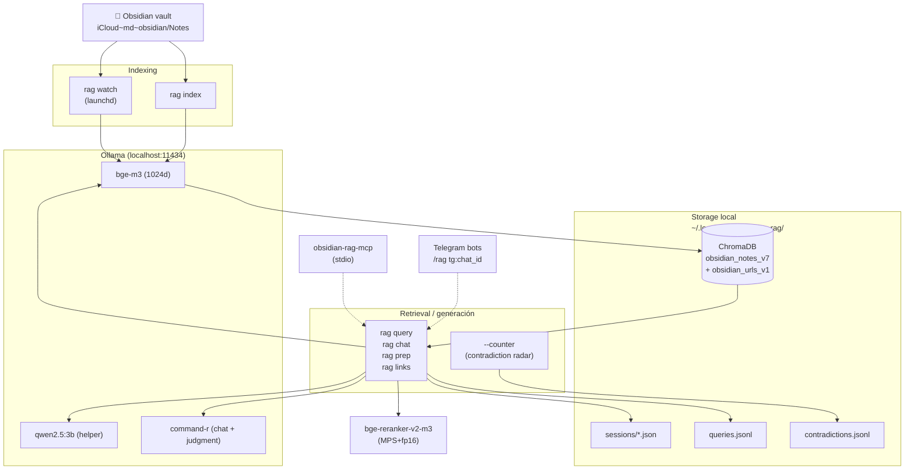
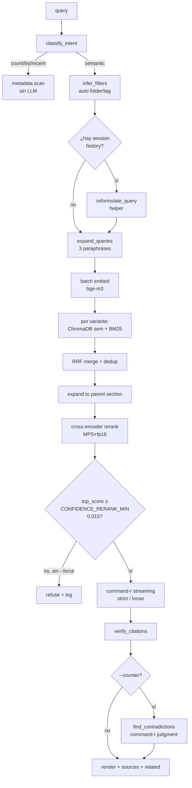
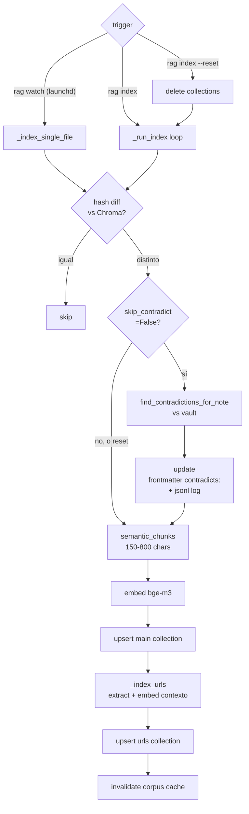
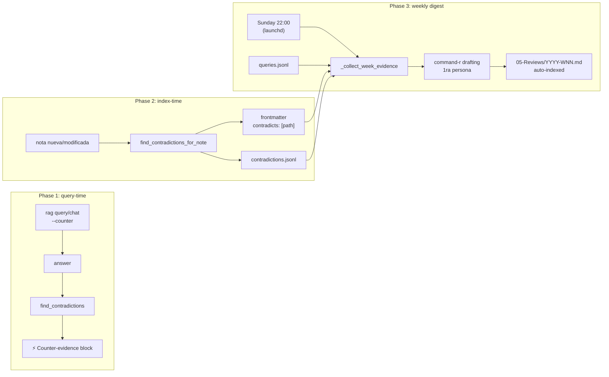
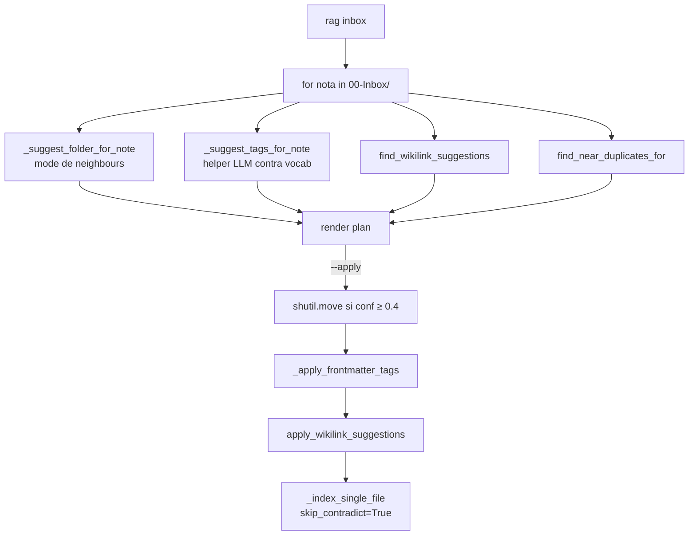

# obsidian-rag

RAG local sobre el vault de Obsidian, fully local: ChromaDB + Ollama + sentence-transformers. Sin cloud, sin telemetría.

> **Para la guía de arquitectura interna y decisiones de diseño, ver [CLAUDE.md](./CLAUDE.md).** Este README es la **referencia operativa**: comandos, flags, paths, schemas, recetas — lo que se olvida y hay que poder buscar.

---

## Tabla de contenidos

1. [Qué es y cómo se compone](#qué-es-y-cómo-se-compone)
2. [Instalación / setup](#instalación--setup)
3. [Storage layout](#storage-layout-dónde-vive-cada-cosa)
4. [Arquitectura: pipelines](#arquitectura-pipelines)
5. [Comandos — referencia completa](#comandos--referencia-completa)
6. [Configuración (env vars + modelos)](#configuración-env-vars--modelos)
7. [Frontmatter conventions](#frontmatter-conventions)
8. [MCP tools](#mcp-tools)
9. [Automation (launchd)](#automation-launchd)
10. [Recetas comunes](#recetas-comunes)
11. [Troubleshooting](#troubleshooting)
12. [Findings empíricos clave](#findings-empíricos-clave-no-olvidar)

---

## Qué es y cómo se compone

Una sola CLI (`rag`) sobre `~/repositories/obsidian-rag/rag.py` (~5500 líneas) + un MCP server (`obsidian-rag-mcp`) sobre `mcp_server.py`.



---

## Instalación / setup

```bash
cd ~/repositories/obsidian-rag
uv tool install --reinstall --editable .   # binarios: rag, obsidian-rag-mcp
rag index                                  # primer indexado del vault
rag setup                                  # instala launchd: watch + digest
```

**Dependencias del sistema** (Homebrew):
- `ollama` corriendo en `localhost:11434` con `bge-m3`, `qwen2.5:3b`, `command-r:latest` instalados.
- Python 3.13 vía `uv`.

**Para correr tests**:
```bash
.venv/bin/python -m pytest tests/ -q             # full suite (~3s)
.venv/bin/python -m pytest tests/test_X.py -q    # un módulo
.venv/bin/python -m pytest tests/test_X.py::test_Y    # un caso
```

---

## Storage layout (dónde vive cada cosa)

| Path | Qué guarda |
|---|---|
| `~/.local/share/obsidian-rag/chroma/` | ChromaDB persistente. Dos collections: `obsidian_notes_v7` (chunks) + `obsidian_urls_v1` (URLs con contexto embebido) |
| `~/.local/share/obsidian-rag/sessions/<id>.json` | Sesiones conversacionales (1 archivo por sesión) |
| `~/.local/share/obsidian-rag/last_session` | Pointer a la última session id usada (`--continue`/`--resume`) |
| `~/.local/share/obsidian-rag/queries.jsonl` | Log append-only de cada query/chat/links event |
| `~/.local/share/obsidian-rag/contradictions.jsonl` | Log append-only de contradicciones detectadas al indexar |
| `~/.local/share/obsidian-rag/watch.log` & `.error.log` | Logs del servicio launchd `rag watch` |
| `~/.local/share/obsidian-rag/digest.log` & `.error.log` | Logs del servicio launchd `rag digest` |
| `~/Library/LaunchAgents/com.fer.obsidian-rag-{watch,digest}.plist` | Plists generados por `rag setup` |
| `~/.local/share/uv/tools/obsidian-rag/` | Tool venv instalado por `uv tool install` |
| `<repo>/.venv/` | Venv local para tests (pytest acá) |
| `<vault>/05-Reviews/YYYY-WNN.md` | Output del weekly digest |
| `<vault>/00-Inbox/YYYY-MM-DD-prep-<slug>.md` | Output de `rag prep --save` |
| `<vault>/00-Inbox/<title>.md` | Output de `/save` desde chat |

**Per-vault namespace**: si seteás `OBSIDIAN_RAG_VAULT=/otra/ruta`, las collections se renombran a `<base>_<sha8>` automáticamente para no compartir índice.

---

## Arquitectura: pipelines

### Retrieval



### Indexing



### Contradiction Radar (3 fases)



### Inbox triage (composición)



---

## Comandos — referencia completa

### Indexing

| Comando | Función |
|---|---|
| `rag index` | Indexado incremental (hash-based). Detecta cambios y solo re-embebe lo que cambió. Corre check de contradicciones por defecto en notas modificadas. |
| `rag index --reset` | Drop + rebuild ambas collections (notes + urls). **Skip contradicción automático** (sería O(n²) LLM calls). |
| `rag index --no-contradict` | Incremental sin check de contradicciones. |
| `rag watch` | Daemon: re-indexa en cada save del vault (debounce 3s, watchdog). Manejado por launchd vía `rag setup`. |
| `rag watch --debounce 5` | Debounce custom en segundos. |

### Query / chat (retrieval)

| Comando | Función |
|---|---|
| `rag query "<q>"` | Consulta única. Pipeline completo: classify → expand → retrieve → rerank → LLM. |
| `rag query --hyde` | HyDE on. **Cuidado**: con qwen2.5:3b empeora hit@5 (95→90). Activar solo con LLMs grandes. |
| `rag query --no-multi` | Sin multi-query expansion (solo la query original). |
| `rag query --no-auto-filter` | No infiere folder/tag desde la query. |
| `rag query --raw` | Skip LLM; muestra los chunks crudos. |
| `rag query --loose` | Permite prosa externa del LLM (marcada con ⚠). Default es strict. |
| `rag query --force` | Ignora la confidence gate y llama al LLM igual. |
| `rag query --counter` | Contradiction radar query-time: muestra chunks que contradicen la respuesta. |
| `rag query --session <id>` | Guarda + reanuda sesión por id. Telegram usa `tg:<chat_id>`. |
| `rag query --continue` | Atajo a `--session <last_session>`. |
| `rag query --plain` | Salida sin colores/paneles para consumo programático (bots). |
| `rag query --folder X --tag Y -k 8` | Filtros explícitos, k custom. |
| `rag chat` | Chat interactivo. Mismo pipeline pero multi-turn. |
| `rag chat --session/--resume/--counter` | Idem query. |
| `rag chat --precise` | HyDE + reformulación (≈+5s). |

**Intents en chat** (NL detectados antes de tratar como query):
- Reindex: `/reindex [reset]` o NL ("reindexá", "actualizá el vault", "reescaneá las notas")
- Save: `/save [título]` o NL ("guardá esto", "creá una nota llamada X")
- Links: `/links <q>` o NL ("dame el link a X", "documentación de Y", "donde está el url de Z")

### Sesiones conversacionales

| Comando | Función |
|---|---|
| `rag session list [-n 20]` | Lista sesiones recientes (id, turns, modo, fecha, primera query). |
| `rag session show <id>` | Muestra todos los turns de una sesión. |
| `rag session clear <id> [--yes]` | Borra una sesión. |
| `rag session cleanup [--days 30]` | Purga sesiones más viejas que N días por mtime. |

**Schema** (`~/.local/share/obsidian-rag/sessions/<id>.json`):
```json
{
  "id": "...", "created_at": "...", "updated_at": "...", "mode": "chat|query|mcp",
  "turns": [{"ts": "...", "q": "...", "q_reformulated": "...?", "a": "...", "paths": [...], "top_score": 0.42, "contradictions": [...]}]
}
```
Caps: TTL 30 días, 50 turns por sesión, history window 6 messages para reformulación. ID admite `[A-Za-z0-9_.:-]{1,64}`.

### URL finder

| Comando | Función |
|---|---|
| `rag links "<q>"` | URLs ranked por contexto semántico — sin LLM. OSC 8 hyperlinks. |
| `rag links "<q>" -k 20 --folder X --tag Y` | Cap, filtros. |
| `rag links "<q>" --open 3` | Abre la URL del rank 3 en el browser default (macOS `open`). |
| `rag links "<q>" --plain` | Salida plana. |
| `rag links --rebuild` | Re-extrae URLs de todas las notas sin re-embeddar chunks (~1 min). **Auto-corre** la primera vez si la collection está vacía pero el vault está indexado. |

### Wikilink density

| Comando | Función |
|---|---|
| `rag wikilinks suggest` | Dry-run, todo el vault. Lista menciones de títulos sin wikilinkear. |
| `rag wikilinks suggest --note <path>` | Solo una nota. |
| `rag wikilinks suggest --folder X` | Solo bajo este folder. |
| `rag wikilinks suggest --apply` | Escribe los `[[wikilinks]]` y re-indexa. |
| `rag wikilinks suggest --min-len 5 --max-per-note 20 --show 10` | Ajustes. |

Skips: frontmatter, fenced/inline code, existing wikilinks, markdown links, HTML tags. Skipea títulos ambiguos (mismo string → varios paths) y self-links.

### Daily productivity

| Comando | Función |
|---|---|
| `rag dupes [--threshold 0.85] [--folder X] [--limit 50] [--plain]` | Pares de notas con centroides similares. Numpy. <1s sobre 521 notas. |
| `rag inbox [--folder 00-Inbox] [--apply]` | Triage cada nota: folder destino + tags + wikilinks + duplicados. `--apply` mueve + escribe + reindexa (si confianza ≥ 0.4). |
| `rag inbox --no-folder/--no-tags/--no-wikilinks` | Skip individual signals. |
| `rag inbox --max-tags 5 --limit 20 --folder-min-conf 0.4` | Tunings. |
| `rag prep "<topic>"` | Brief de contexto sobre persona/proyecto/tema. command-r drafts 350-550 palabras estructurado. |
| `rag prep "<topic>" --save` | Guarda a `00-Inbox/YYYY-MM-DD-prep-<slug>.md` y auto-indexa. |
| `rag prep "<topic>" --folder X -k 8 --no-urls --no-related --plain` | Filtros. |

### Agent loop

| Comando | Función |
|---|---|
| `rag do "<instrucción>"` | Tool-calling agent con command-r. Tools: search, read_note, list_notes, propose_write. **Writes son dry-run** (acumulados en `_AGENT_PENDING_WRITES`, confirmás cada uno al final). |
| `rag do "..." --yes --max-iterations 12` | Skip confirmación + cap de iteraciones. |

### Eval / observabilidad

| Comando | Función |
|---|---|
| `rag eval` | Corre `queries.yaml` (singles + chains). Imprime hit@k, MRR, recall@k, chain_success. |
| `rag eval --hyde --no-multi -k 10 --file otro.yaml` | Variantes. |
| `rag log [-n 20]` | Tail últimas N queries del jsonl. |
| `rag log --low-confidence` | Filtra queries con `top_score ≤ CONFIDENCE_RERANK_MIN`. Útil para gap detection. |
| `rag stats` | Estado: chunks, URLs, vault path, collections, modelos, pipeline. |
| `rag gaps [--threshold 0.015] [--min-count 2] [--days 60]` | Cluster low-confidence queries del log → temas que el vault no responde. |
| `rag timeline [--query Q] [--tag T] [--folder F] [--limit N]` | Notas ordenadas por mtime. |
| `rag graph <note-title> [--depth 2] [--output file.html]` | Grafo local en torno a una nota. |
| `rag autotag <path> [--apply] [--max-tags 6]` | Sugiere tags del vocabulario. |
| `rag digest [--week YYYY-WNN] [--days 7] [--dry-run]` | Weekly narrative digest. Auto-corre los domingos 22:00 vía launchd. |

### Automation

| Comando | Función |
|---|---|
| `rag setup` | Instala launchd: `com.fer.obsidian-rag-watch` + `com.fer.obsidian-rag-digest`. Idempotente (re-correr recarga). |
| `rag setup --remove` | Desinstala ambos. |

```bash
# Inspección de los servicios
launchctl list | grep obsidian-rag
tail -f ~/.local/share/obsidian-rag/{watch,digest}.log
```

### MCP server

```bash
obsidian-rag-mcp   # se lanza por Claude Code on demand, no manualmente
```

---

## Configuración (env vars + modelos)

| Env var | Default | Función |
|---|---|---|
| `OBSIDIAN_RAG_VAULT` | iCloud Notes | Override del vault path. Las collections se namespace con sha8 del path. |
| `OLLAMA_KEEP_ALIVE` | `-1` (forever) | Pasado a cada `ollama.chat/embed`. Evita reload de modelos entre queries. Acepta int (segundos) o duration string ("30m"). |
| `HF_HUB_OFFLINE` / `TRANSFORMERS_OFFLINE` | `1` | Reranker se carga del caché local. |

**Stack de modelos** (definidos al tope de `rag.py`):

| Rol | Modelo | Cuándo se usa |
|---|---|---|
| Chat (answers + contradiction judgment + prep + digest) | `command-r:latest` (preferido) → `qwen2.5:14b` → `phi4:latest` | `resolve_chat_model()` toma el primero instalado |
| Helper (paraphrase, HyDE, history reformulation, autotag) | `qwen2.5:3b` | Tareas baratas y rápidas |
| Embeddings | `bge-m3` (multilingual, 1024d) | Indexing + queries |
| Reranker | `BAAI/bge-reranker-v2-m3` | Cross-encoder, **forzado a `device=mps`+`fp16`** en Apple Silicon |

**Decoding** (deterministic — esto es retrieval, no creative writing):

```python
CHAT_OPTIONS   = {"temperature": 0, "top_p": 1, "seed": 42, "num_ctx": 4096, "num_predict": 768}
HELPER_OPTIONS = {"temperature": 0, "top_p": 1, "seed": 42, "num_ctx": 1024, "num_predict": 128}
```

---

## Frontmatter conventions

| Key | Quién la escribe | Para qué |
|---|---|---|
| `tags: [a, b, c]` | manual / `rag autotag` / `rag inbox --apply` | Filtros + autotag vocab |
| `related: '[[note-X]]', ...` | `save_note` (chat `/save`) | Indexed como signal extra |
| `contradicts: [vault-path, ...]` | Phase 2 contradiction radar (auto al indexar) | Surfacing en Obsidian/dataview + input al weekly digest |
| `area: ...` | manual (campo `FM_SEARCHABLE_FIELDS`) | Indexado en metadata |
| `cancion`, `familia`, `estado`, `periodo`, `created`, `modified` | manual | Idem (otros searchable fields) |
| `type: prep`, `topic: ...`, `sources: [[[X]]]`, `tags: [prep]` | `rag prep --save` | Marca briefs de prep |
| `tags: [review, weekly-digest]`, `week: YYYY-WNN` | `rag digest` | Marca digests semanales |
| `transcript-source: voice` (planeado) | bot Telegram con `/note` | Marca notas dictadas por voz |

---

## MCP tools

Expuestos por `obsidian-rag-mcp` vía stdio. Registro en `~/.claude.json` (Claude Code los lanza on demand).

| Tool | Args | Devuelve |
|---|---|---|
| `rag_query` | `question, k=5, folder?, tag?, multi_query=True, session_id?` | Lista de chunks `{note, path, folder, tags, score, content}` |
| `rag_links` | `query, k=5, folder?, tag?` | Lista de URLs `{url, anchor, path, note, line, context, score}` |
| `rag_read_note` | `path` | Contenido completo del archivo (vault-relative path validado) |
| `rag_list_notes` | `folder?, tag?, limit=100` | Lista de notas `{note, path, folder, tags}` |
| `rag_stats` | — | `{chunks, collection, embed_model, reranker, vault_path}` |

---

## Automation (launchd)

Servicios instalados por `rag setup`:

| Label | Comando | Trigger | Logs |
|---|---|---|---|
| `com.fer.obsidian-rag-watch` | `rag watch` | RunAtLoad + KeepAlive | `~/.local/share/obsidian-rag/watch.{log,error.log}` |
| `com.fer.obsidian-rag-digest` | `rag digest` | StartCalendarInterval `domingo 22:00 local` | `~/.local/share/obsidian-rag/digest.{log,error.log}` |

```bash
rag setup                      # install/recarga
rag setup --remove             # uninstall
launchctl list | grep obsidian-rag
launchctl unload ~/Library/LaunchAgents/com.fer.obsidian-rag-watch.plist
launchctl load   ~/Library/LaunchAgents/com.fer.obsidian-rag-watch.plist
```

---

## Recetas comunes

### Hacer una pregunta estricta sin alucinaciones
```bash
rag query "qué dice X"                       # default strict, refuse si confidence baja
rag query "qué dice X" --counter             # + counter-evidence
```

### Conversar con seguimiento (pronombres absorben contexto)
```bash
rag chat --resume                            # reanuda última sesión
rag query --continue "y eso otro?"           # one-shot follow-up
```

### Buscar el link literal (no prosa)
```bash
rag links "documentación de claude code"
rag links "ollama" --open 1
```

### Triar el Inbox semanalmente
```bash
rag inbox                                    # dry-run primero
rag inbox --apply                            # mueve + taggea + linkifica
```

### Preparar para una llamada / sesión
```bash
rag prep "Maria coaching liderazgo" --save
# → ~/Vault/00-Inbox/2026-04-15-prep-maria-coaching-liderazgo.md
```

### Densificar el grafo de Obsidian
```bash
rag wikilinks suggest --folder 02-Areas/Coaching        # dry-run
rag wikilinks suggest --folder 02-Areas/Coaching --apply
```

### Detectar duplicados acumulados
```bash
rag dupes --threshold 0.90 --limit 20
```

### Agente con tools (multi-step)
```bash
rag do "listame qué notas tengo sobre ikigai y proponé un índice"
# → llama list_notes + propose_write, te pide confirmación al final
```

### Forzar regeneración del weekly digest
```bash
rag digest --week 2026-W15
```

### Investigar un fallo de retrieval
```bash
rag log --low-confidence                     # qué queries gatearon
rag query "<la query>" --raw                 # ver chunks crudos
rag query "<la query>" --force --loose       # llamar LLM igual con ⚠
rag eval                                     # baseline contra queries.yaml
```

### Bumpar schema de la collection
1. Editar `_COLLECTION_BASE` (ej. `obsidian_notes_v8`) en `rag.py`.
2. `uv tool install --reinstall --editable .`
3. `rag index --reset` → drop ambas collections + reindex.
4. (Opcional) borrar collections viejas: `rag.get_db()` se construye on demand, las viejas quedan huérfanas en `~/.local/share/obsidian-rag/chroma/` — se pueden listar con un script Python o ignorar.

### Migrar a otro vault temporalmente
```bash
OBSIDIAN_RAG_VAULT=/otro/vault rag index    # crea collection nueva con sha8 suffix
OBSIDIAN_RAG_VAULT=/otro/vault rag chat
```

---

## Troubleshooting

| Síntoma | Causa probable | Fix |
|---|---|---|
| `rag query` cuelga o tarda 60s+ | Modelo cold-loaded (Ollama liberó VRAM) | Setear `OLLAMA_KEEP_ALIVE=-1` (default ya). Verificar `ollama ps`. |
| Reranker tardando ~3× lo normal | Sentence-transformers cayó a CPU en uv venv | Verificar `get_reranker()` fuerza `device="mps"+fp16`. NO remover esa línea. |
| `rag chat --counter` da false positives | Query-time detector usa command-r ya, debería estar bien | Si pasa, mirar `helper_raw` en `queries.jsonl`. Tunear el prompt en `find_contradictions`. |
| Phase 2 contradictions ruidosas en frontmatter | command-r flagueando matices como contradicción | Bajar verbosidad: `rag index --no-contradict` para una corrida; o tunear el prompt. |
| `rag links` devuelve solo imágenes | Filtro de media no está actualizado | Revisar `_IMAGE_EXT_RE`. Re-correr `rag links --rebuild`. |
| Tests fallan con `chromadb` errors | Tmp path conflicts o cache stale | Borrar `tests/__pycache__/`, re-correr. |
| URL collection vacía después de upgrade | Auto-backfill aún no disparó | `rag links "anything"` lo trigerea, o forzar con `rag links --rebuild`. |
| Sesión no se reanuda con `--resume` | `last_session` pointer apunta a una sesión borrada | `rag session list` para ver vivas, `--session <id>` explícito. |
| `rag setup` falla al cargar | Plist ya cargado o sintaxis inválida | `launchctl unload <path>` manual + ver `launchctl error`. |
| `rag watch` no re-indexa | El servicio puede haber crasheado | `tail ~/.local/share/obsidian-rag/watch.error.log`; `launchctl kickstart -k gui/$(id -u)/com.fer.obsidian-rag-watch`. |
| Eval baseline cae | Schema bump (v6→v7 = -5%) o cambio en pipeline | `rag eval --no-multi` para aislar el efecto del multi-query. Comparar contra el baseline en CLAUDE.md. |
| `rag wikilinks suggest --apply` rompió un archivo | La regex no debería pero por las dudas | `git diff` en el vault si está versionado. Sino, re-escribir desde Obsidian (los `[[wrap]]` son no-destructivos). |

---

## Findings empíricos clave (no olvidar)

1. **HyDE con qwen2.5:3b empeora hit@5 (95→90 en queries.yaml)**. El modelo chico drift-ea el hipotético del fraseo real. Default OFF. Re-medir solo si el helper sube de tier (≥7B).
2. **qwen2.5:3b es no-determinista incluso con `temp=0 seed=42`** sobre judgment tasks (contradicciones). Mismo caso da FP primera vez, empty segunda. Y emite JSON malformado con frecuencia. Por eso los detectores de contradicción usan **command-r**, no helper.
3. **Reranker pierde 3× performance si cae a CPU**. La línea `device="mps"+fp16` en `get_reranker()` es crítica en uv venvs (donde el auto-detect falla).
4. **ChromaDB + BM25 sobre el GIL están serializados**. ThreadPoolExecutor sobre los retrievals los hizo 3× MÁS LENTOS en M3 Max. NO paralelizar.
5. **Cache del corpus invalidado por `col.count()` delta**. Update de chunks que no cambia el count NO invalida — aceptable para chat dentro del mismo proceso (cold→warm: 341ms → 2ms).
6. **CONFIDENCE_RERANK_MIN = 0.015** calibrado para `bge-reranker-v2-m3` sobre este vault. Irrelevantes ~0.005-0.015, borderline 0.02-0.10, claramente relevantes > 0.2. Re-calibrar si el reranker cambia.
7. **Per-file cap en `find_urls` = 2**. Sin esto, una sola nota domina los top-K (descubierto al ver 10 imágenes del mismo archivo en la primera versión).
8. **Wikilink suggester con `min_title_len=4`** filtra colisiones de títulos cortos (TDD/AI/X).
9. **Phase 2 (index-time contradiction) skipea en `--reset`** automáticamente: full reindex con LLM call por nota = O(n²) inaceptable. Se asume que los contradicts viejos sobreviven al reset si quedaron en el frontmatter.
10. **El URL sub-index embebe el CONTEXTO (±240 chars), no la URL**. Match semántico contra prosa, no contra el string http://...
11. **Session memory + Telegram**: el bot pasa `tg:<chat_id>` como session_id literal. Validador `SESSION_ID_RE` lo permite. TTL 30 días.

---

## Suite de tests

| Archivo | Casos | Cubre |
|---|---|---|
| `tests/test_sessions.py` | 22 | Persistencia + IDs + window + TTL + cleanup |
| `tests/test_contradictions.py` | 16 | find_contradictions + render + edge cases (mocks) |
| `tests/test_digest.py` | 11 | Week label/parse + collect + digest dry-run/write |
| `tests/test_urls.py` | 30 | Extract URLs + find_urls + index_urls + link intent |
| `tests/test_wikilinks.py` | 23 | Skip mask + suggester + apply + edge cases |
| `tests/test_dupes.py` | 11 | Pairwise sims + threshold + folder filter + centroid |
| `tests/test_inbox.py` | 13 | Folder/tag suggester + frontmatter rewrite + triage compose |
| **Total** | **126** | |

Correr: `.venv/bin/python -m pytest tests/ -q` (~3s). pytest está en `[project.optional-dependencies].dev`.
