# obsidian-rag — System documentation

Documento canónico de cómo funciona el sistema completo: qué hay, cómo se comunica, qué pasa cuando pasa cada cosa, y por qué está diseñado así.

**Lector objetivo**: vos dentro de 6 meses, otro Claude continuando el proyecto, o alguien migrando el sistema a otra Mac. Asume que ya leíste `README.md` (comandos + flags) y opcionalmente `CLAUDE.md` (decisiones de diseño).

Complementa pero no duplica:
- **[CLAUDE.md](../CLAUDE.md)** — decisiones arquitecturales, trade-offs, findings empíricos.
- **[README.md](../README.md)** — referencia operativa, comandos, recetas.
- **Este doc** — modelo conceptual, data flows end-to-end, lifecycle de una nota.

---

## Tabla de contenidos

1. [Modelo conceptual](#1-modelo-conceptual)
2. [Mapa de componentes](#2-mapa-de-componentes)
3. [Data flows principales](#3-data-flows-principales)
4. [Lifecycle de una nota](#4-lifecycle-de-una-nota)
5. [State management](#5-state-management)
6. [Superficies de uso](#6-superficies-de-uso)
7. [Concurrencia y fallo](#7-concurrencia-y-fallo)
8. [Performance envelope](#8-performance-envelope)
9. [Extensión: cómo agregar una feature](#9-extensión-cómo-agregar-una-feature)

---

## 1. Modelo conceptual

El sistema trata al **vault de Obsidian** como **fuente de verdad inmutable** y construye capas de análisis encima sin reescribirlo (salvo escrituras explícitas y auditables como `rag wikilinks --apply`, `rag inbox --apply`, o el flag `contradicts:` en frontmatter).

Tres niveles conceptuales:

```
┌─────────────────────────────────────────────────┐
│  NIVEL 3: Aplicaciones                          │
│  rag chat · rag prep · rag morning · rag do    │
│  WhatsApp listener · MCP tools · weekly digest  │
│  ← aquí el usuario HABLA con el vault           │
├─────────────────────────────────────────────────┤
│  NIVEL 2: Primitivas composables                │
│  retrieve · find_related · find_urls            │
│  find_contradictions · find_wikilink_           │
│  suggestions · find_dead_notes · find_          │
│  duplicate_notes · capture_note · reformulate   │
│  ← pura función, sin side-effects de negocio    │
├─────────────────────────────────────────────────┤
│  NIVEL 1: Índices                               │
│  obsidian_notes_v11 (chunks + metadata)         │
│  obsidian_urls_v1 (URL + contexto)              │
│  title_to_paths / outlinks / backlinks          │
│  queries.jsonl · contradictions.jsonl           │
│  ← estado derivado del vault (regenerable)      │
├─────────────────────────────────────────────────┤
│  NIVEL 0: Vault de Obsidian (fuente)            │
│  ~/Library/Mobile Documents/                    │
│  iCloud~md~obsidian/Documents/Notes/            │
└─────────────────────────────────────────────────┘
```

**Invariante fundamental**: el Nivel 1 se puede tirar y reconstruir desde el Nivel 0 en ~30 min (`rag index --reset`). El Nivel 2 es puro código. El Nivel 3 es la cara pública.

---

## 2. Mapa de componentes

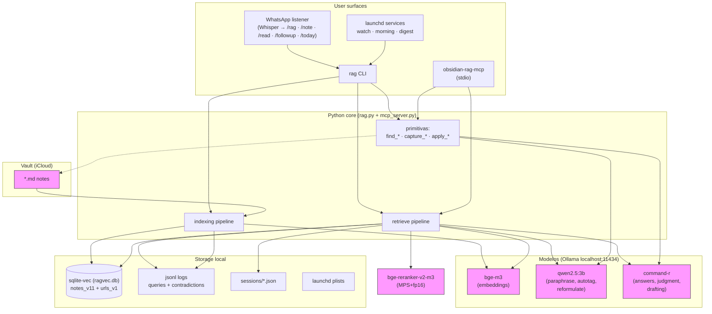

### Responsabilidades

| Componente | Responsabilidad | Lo que NUNCA hace |
|---|---|---|
| `rag.py` | CLI + todas las primitivas + pipelines | Llamadas de red externas (solo localhost) |
| `mcp_server.py` | Wrapper fino sobre las primitivas para Claude Code | Lógica nueva — delega a `rag.py` |
| sqlite-vec (`ragvec.db`) | Almacén vectorial persistente | Ser fuente de verdad — reconstructible del vault |
| Ollama | Servir embeddings + LLMs locales | Persistir estado de negocio |
| WhatsApp listener | Adapter texto/voz → `rag` CLI vía bridge local | Mantener historial del RAG (usa `rag` para eso) |
| launchd | Mantener `watch`/`morning`/`digest` vivos | Saber qué hace cada comando |

---

## 3. Data flows principales

### 3.1 Indexing (cambio de nota → estado)

Dos triggers: `rag index` (bulk) o `rag watch` (watchdog, continuo). Ambos llaman a `_index_single_file` por nota.

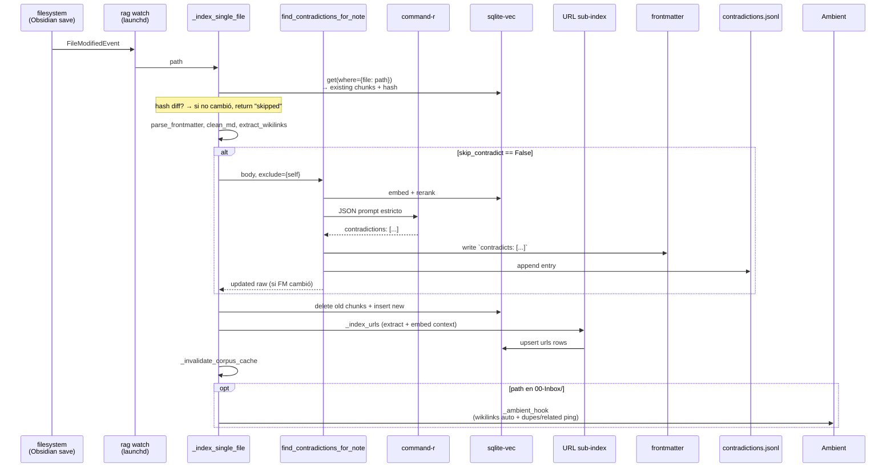

**Guardrail clave**: el chequeo de contradicción solo corre incremental. `rag index --reset` lo skipea automáticamente (sería O(n²) calls a command-r).

### 3.2 Retrieval (pregunta → respuesta)

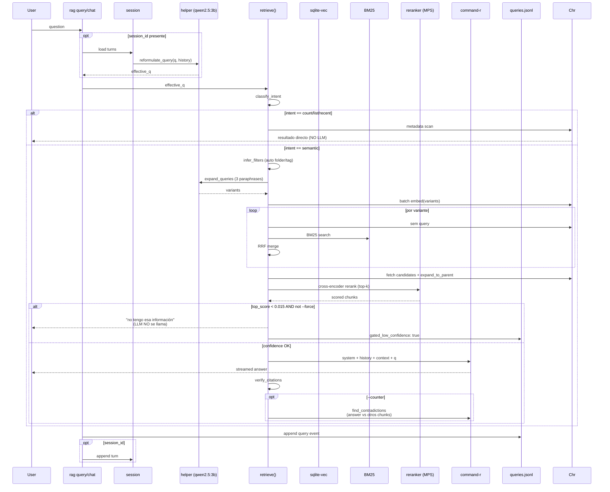

### 3.3 Contradiction Radar (3 fases)

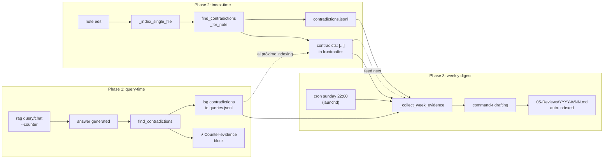

**Decisión clave**: las 3 fases usan `command-r` como judge (NO el helper). qwen2.5:3b dio false positives + JSON malformado — command-r hugs source text y responde parseable. Ver `CLAUDE.md` finding #2.

### 3.3.5 Ambient Agent (hook reactivo de Inbox)

Se dispara al final de `_index_single_file` cuando el path está en `00-Inbox/` y el hash cambió. Composición de primitivas existentes, **sin LLM extra**:

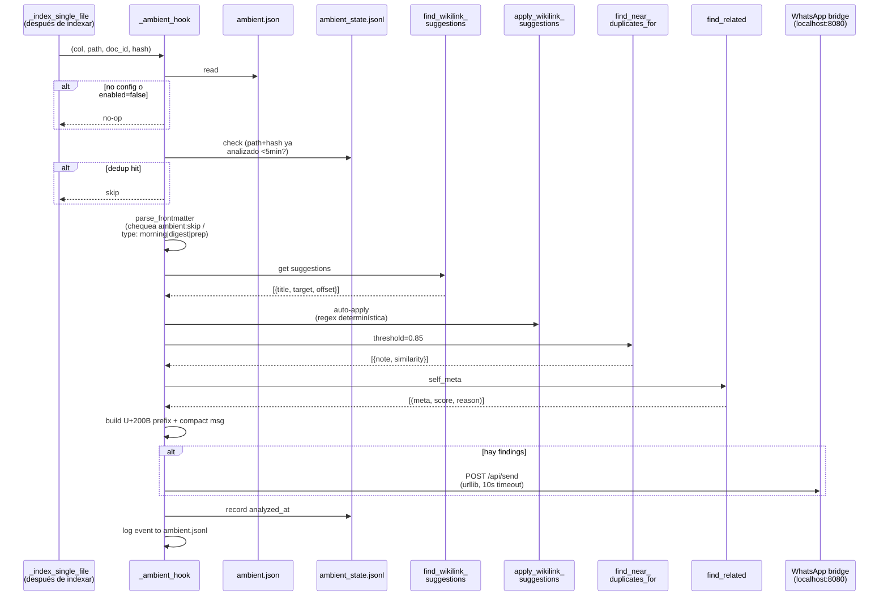

Ping de ejemplo en el self-chat *RagNet* de WhatsApp:

```
🤖 Ambient: [[caminata-ideas]]
🔗 Linkeé 2: Ikigai, Moka
⚠ Posibles duplicados:
  · [[Ideas - caminata 2026-02]]  sim 0.88
📎 Relacionadas:
  · [[Coaching - Propósito]]  ×8 ↔#
  · [[Músicos y ikigai]]  ×4 #
```

**Desacople clave**: rag.py hace POST directo al bridge local `http://localhost:8080/api/send` (urllib, 10s timeout). El mensaje arranca con U+200B (anti-loop — el listener lo ignora para no procesar sus propios outputs como queries entrantes). NO depende del listener estando up: si el listener muere, el análisis corre y queda en `ambient.jsonl`; solo se pierde el ping hasta que el bridge lo entregue.

### 3.4 Capture → Morning → Digest (el loop diario/semanal)

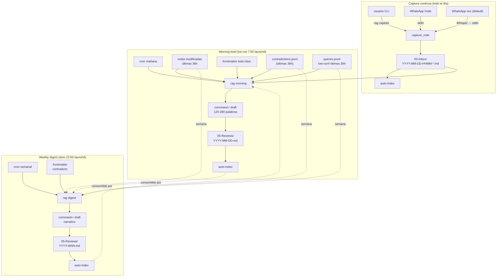

El loop se auto-alimenta: un brief matutino es una nota que podría aparecer en el digest semanal; un digest semanal es contexto para el próximo morning.

### 3.5 Chat intent routing (texto → ¿qué hacer?)

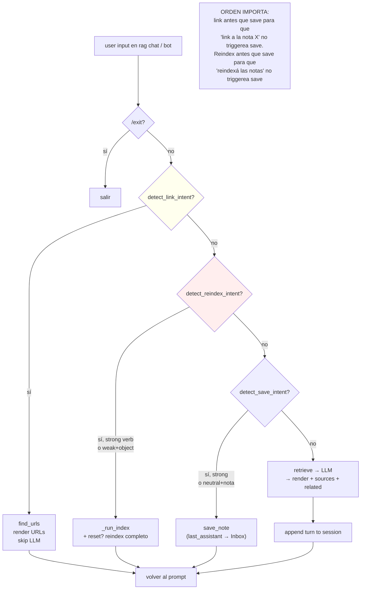

Todos los detectores son regex + word-boundary. Ningún LLM se llama para clasificar intención — determinístico y rápido.

---

## 4. Lifecycle de una nota

El viaje completo de una idea, desde capture hasta posible archivo. Ilustra cómo casi todas las primitivas del sistema tocan una nota en algún momento.

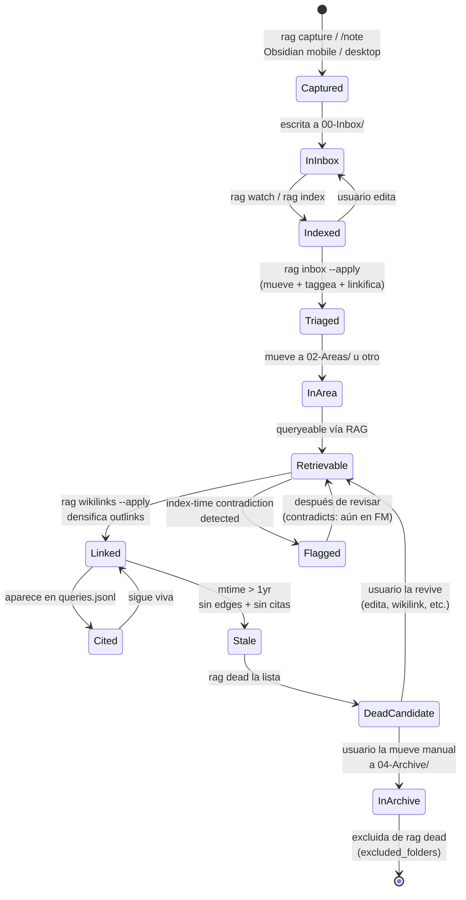

### Qué primitiva entra en cada paso

| Transición | Comando / primitiva | Escribe |
|---|---|---|
| `∅ → Captured` | `rag capture`, `/note`, voice + caption | `00-Inbox/YYYY-MM-DD-HHMM-*.md` |
| `Captured → Indexed` | `_index_single_file` (via `rag watch` o `rag index`) | sqlite-vec chunks + URLs |
| `InInbox → Triaged` | `rag inbox --apply` | Mueve archivo + frontmatter tags + wikilinks |
| `Indexed → Flagged` | `find_contradictions_for_note` (phase 2) | `contradicts:` en frontmatter + `contradictions.jsonl` |
| `Retrievable → Linked` | `rag wikilinks suggest --apply` | `[[wrapped]]` menciones en body |
| `* → Cited` | `rag query/chat` retrieves it | `paths: [...]` en queries.jsonl |
| `* → DeadCandidate` | `rag dead` | Nada (solo lista — el usuario decide) |

---

## 5. State management

### 5.1 sqlite-vec collections

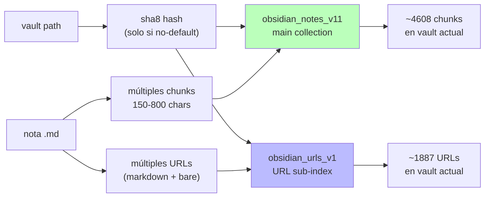

**Invariantes**:
- Bump de `_COLLECTION_BASE` = rebuild obligatorio (fresh collection).
- `OBSIDIAN_RAG_VAULT` distinto del default → sha8 suffix automático. Aisla vaults.
- Orphan cleanup: archivos removidos del disk → sus chunks se borran en el próximo `rag index`.

### 5.2 Session lifecycle

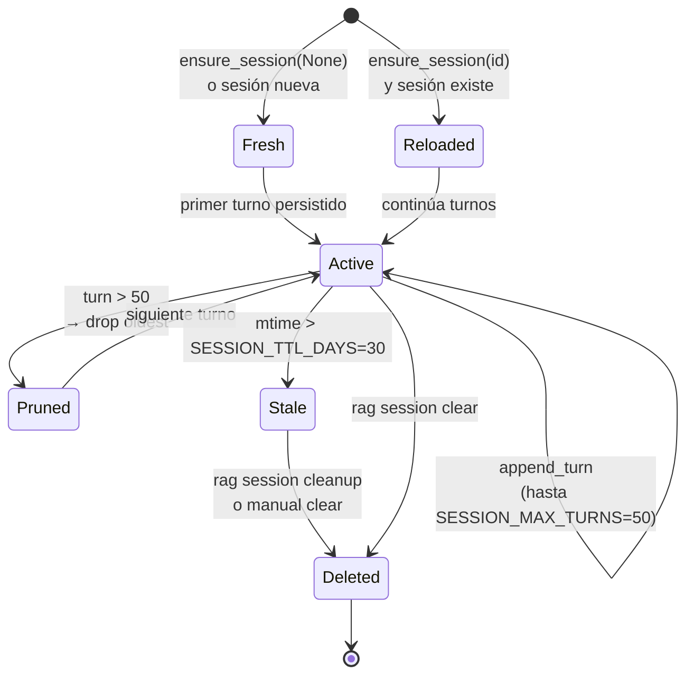

IDs opacos: `[A-Za-z0-9_.:-]{1,64}`. El listener de WhatsApp pasa `wa:<jid>` literal (ej: `wa:120363426178035051@g.us`); CLI usa autogen `<unixhex>-<rand6>`. Sesiones `tg:<chat_id>` viejas siguen válidas (formato idéntico) pero nunca se reactivan desde el nuevo listener.

### 5.3 Launchd services (automatización)

```mermaid
gantt
    title Servicios launchd (horario local)
    dateFormat HH:mm
    axisFormat %H:%M
    section watch
    continuo (KeepAlive)  :active, w, 00:00, 24h
    section morning (lun-vie)
    morning brief       :m1, 07:00, 10m
    section digest (domingo)
    weekly digest       :d1, 22:00, 15m
```

Los tres servicios son **independientes**. Si `watch` muere, no afecta `morning`/`digest`. Cada uno loggea a `~/.local/share/obsidian-rag/<name>.{log,error.log}`.

### 5.4 Log files (append-only, never rotated automatically)

| Log | Escribe | Lee |
|---|---|---|
| `queries.jsonl` | Cada `rag query`/`chat`/`links`/`dead` | `rag log`, `rag gaps`, `rag morning`, `rag digest`, `find_dead_notes` |
| `contradictions.jsonl` | `_check_and_flag_contradictions` en indexing | `rag morning`, `rag digest` |
| `ambient.jsonl` | `_ambient_hook` en cada save de Inbox | `rag ambient log` |
| `ambient_state.jsonl` | `_ambient_state_record` tras cada hook | `_ambient_should_skip` (dedup 5min) |
| `ambient.json` | `/enable_ambient` desde el listener WhatsApp | `_ambient_config` en rag.py (schema: `{jid, enabled}`; schema viejo `{chat_id, bot_token}` rechazado con hint) |
| `watch.log` | stdout de `rag watch` | `tail` manual |
| `morning.log` | stdout de `rag morning` | `tail` manual |
| `digest.log` | stdout de `rag digest` | `tail` manual |

**Sin rotación automática** — si crecen mucho (no lo han hecho en meses de uso), `rag log -n 1000 > tmp && mv tmp queries.jsonl` manualmente. TODO: rotación auto.

---

## 6. Superficies de uso

### CLI

Canonical interface. Todas las primitivas están expuestas. Ver `rag --help` o `README.md` para detalle.

### MCP (Claude Code)

5 tools expuestos vía stdio por `obsidian-rag-mcp`:

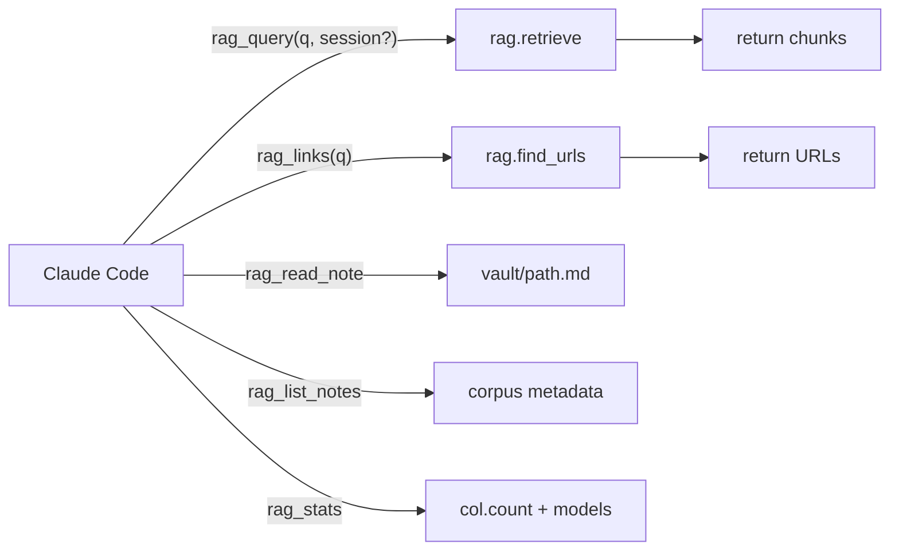

Cada call a `rag_query` con `session_id` extiende la misma sesión que la CLI usa — estado compartido.

### WhatsApp listener — bot unificado

Un solo listener consolida los roles que antes ocupaban los 3 bots de Telegram (`@ffeerrr_bot`, `@ragsystemobs_bot`, `@rauuuliiitoo_bot`). Vive en `~/whatsapp-listener/listener.ts`, arranca vía launchd (`com.fer.whatsapp-listener`), y polea el SQLite del bridge local (`com.fer.whatsapp-bridge`, `http://localhost:8080`). Anti-loop con U+200B prefix (ignora mensajes que arrancan con ZWSP — sus propios outputs vía bridge).

| Trigger | Comportamiento | Backend |
|---|---|---|
| texto libre / `/rag <q>` | query RAG | `rag query --session wa:<jid> --plain` |
| `/read <url>` | ingesta externa → 00-Inbox | `rag read` |
| `/note <t>` | captura manual → 00-Inbox | `rag capture` |
| `/followup [N]` | loops abiertos del vault | `rag followup --days N` |
| `/today` | end-of-day closure | `rag today` |
| voz (default) | Whisper → captura auto | `rag capture --stdin` |
| `/enable_ambient` · `/disable_ambient` · `/ambient_status` | CRUD de `ambient.json` con el JID actual | escribe/lee `~/.local/share/obsidian-rag/ambient.json` |

### WhatsApp — voice + routing detallado

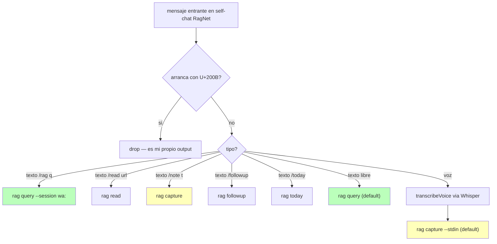

El listener NO mantiene estado conversacional propio — todo vive en el RAG. La session `wa:<jid>` hace que retomes el hilo en el chat y lo encuentres también vía `rag session show wa:<jid>` desde la CLI.

### Automatización (launchd)

Ver §5.3 arriba. Principio: **todo lo que puede ser automático lo es**. El usuario solo interviene cuando quiere generar on-demand (`rag morning --dry-run`, `rag digest --week X`).

---

## 7. Concurrencia y fallo

### Concurrencia

- **sqlite-vec**: single-writer (no concurrent writes desde múltiples procesos al mismo DB). En la práctica: `rag watch` puede chocar con `rag index` manual. Mitigación: evitar correr `rag index` mientras `watch` está procesando un cambio. Lo deseable: poner un file lock; TODO futuro.
- **BM25 + sqlite-vec + GIL**: serializados por el GIL de Python. Paralelizar con `ThreadPoolExecutor` dio 3× MÁS LENTO en M3 Max (medido). No paralelizar.
- **Ollama**: thread-safe del lado servidor; queremos un solo modelo en VRAM (por eso `OLLAMA_KEEP_ALIVE=-1`).
- **Sessions**: write atómico (tmp + replace). Múltiples procesos pueden leer simultáneamente sin issue.

### Fallo y recuperación

| Fallo | Síntoma | Recuperación |
|---|---|---|
| Ollama muere | `rag query` tira error de connection | `brew services start ollama` → reintentar |
| Reranker cae a CPU | Query 3× más lenta | Verificar `get_reranker()` fuerza `device="mps"+fp16`; no removerlo |
| sqlite-vec corrupt | `col.count()` tira excepción | `rag index --reset` desde cero (~30 min) |
| Vault desaparece (iCloud disconnect) | `rag` dice "índice vacío" aunque `ragvec.db` tiene data | Verificar `$OBSIDIAN_RAG_VAULT`; esperar que iCloud monte |
| launchd service crashea | No auto-fire del digest/morning | `launchctl kickstart -k gui/$(id -u)/com.fer.obsidian-rag-<name>` |
| vec collection mismatch (vault movido) | Queries devuelven 0 resultados | Reindex; `_vault_slug` cambió con el path |
| Tests fallan después de edit | `_URLS_BACKFILL_DONE` latch persistente entre tests | Fixture ya resetea; si aparece en test nuevo, monkeypatch a False |

### Data flow en fallo parcial

Cada log write es best-effort (try/except pass). El pipeline de indexing NO rompe porque falló logging. El pipeline de queries NO rompe porque falló session save. Grado alto de robustez ante estado corrupto parcial.

---

## 8. Performance envelope

**Medidas reales en M3 Max sobre vault de 526 notas / 4608 chunks**:

| Operación | Cold | Warm | Notas |
|---|---|---|---|
| `rag query "X"` total | 12-15s | 3-5s | Cold: Ollama carga modelos en VRAM |
| retrieve() interno | ~350ms | ~2ms | Corpus cache (_load_corpus) 341ms → 2ms |
| bge-m3 embed (batch 3) | ~200ms | ~80ms | Un solo call para multi-query |
| BM25 search | <50ms | <5ms | Cache invalidate por `col.count()` delta |
| cross-encoder rerank (20 chunks) | ~1.5s | ~400ms | MPS+fp16; con CPU: 3× |
| command-r gen (500 tok) | ~8s | ~2s | Cold incluye modelo load |
| `rag index` incremental (sin cambios) | ~2s | — | Hash gate evita re-embed |
| `rag index` con 10 notas modificadas | ~15s | — | Sin contradiction check |
| `rag index` con contradiction check | +5-10s por nota | — | command-r call |
| `rag index --reset` full vault | ~30-45min | — | 526 notas desde cero |
| `rag links --rebuild` | ~75s | — | Solo URL extract + embed (no chunks) |
| `rag dupes` | <1s | <1s | Numpy pairwise sobre centroides |
| `rag wikilinks suggest` full vault | ~10s | — | Puro regex contra title_to_paths |
| `rag morning` | ~30s | ~15s | File scan + command-r draft |
| `rag digest --week X` | ~45s | ~20s | Idem + más evidencia |

**Modelos residentes** (con `OLLAMA_KEEP_ALIVE=-1`): ~15GB VRAM (command-r 20GB q4 + bge-m3 1.2GB + qwen2.5:3b 2.4GB). Sin keep-alive: reload penalty ~8s por modelo distinto al anterior.

---

## 9. Extensión: cómo agregar una feature

Patrón que emergió de las últimas 10 features:

1. **Identificar la primitiva nueva** — ¿es composición de lo existente o algo fundamentalmente distinto? Si es composición, casi seguro ya hay el building block (retrieve, find_*, capture_note, _index_single_file).

2. **Escribir la función pura primero** — `find_<something>(col, ...) -> list[dict]` o similar. Sin `console.print`, sin CLI hooks. Testeable en aislamiento.

3. **Si usa LLM para judgment**: usar `resolve_chat_model()` (command-r), NO el helper. qwen2.5:3b es no-determinista para juicio. El helper solo para paraphrase/reformulate (textualmente predecible).

4. **Agregar CLI wrapper** con Click. Flags: siempre ofrecer `--plain` si hay output consumible por scripts/bots, `--dry-run` si es destructivo. `--apply` para comandos "propose y ejecuta".

5. **Tests en `tests/test_<feature>.py`** usando los patrones existentes:
   - Fixture con tmp_path vault + sqlite-vec stub.
   - Monkeypatch `rag.embed`, `rag.get_reranker`, `rag.ollama.chat` para evitar LLM real.
   - Cobertura: happy path, edge case vacío, error handling.

6. **Si es proactivo (auto-fire)**: agregar plist en `_services_spec` de `rag setup`. Reload con `rag setup`.

7. **Actualizar `README.md`** (tabla de comandos) + `CLAUDE.md` (si es decisión de diseño no obvia) + este `SYSTEM.md` (si cambia el modelo conceptual).

8. **Commit cohesivo** con mensaje detallado explicando el "why", no solo el "what".

### Anti-patrones observados

- ❌ Agregar un LLM call en el hot path del retrieve sin medir — termina siendo un cuello de botella.
- ❌ Usar helper para judgment — FP rate lo hace inservible.
- ❌ Paralelizar BM25 + sqlite-vec — GIL serializa igual.
- ❌ Tocar `_invalidate_corpus_cache()` heuristics sin medir.
- ❌ Docs que dupliquen código — apuntar a `rag.py` con línea si hace falta; dejar que el doc explique el POR QUÉ.
- ❌ Remover `device="mps"+fp16` de `get_reranker()` — cae a CPU en uv venvs.

---

## Apéndice: cross-reference rápida

| Pregunta | Ir a |
|---|---|
| "¿Qué comandos hay?" | [README §Comandos](../README.md#comandos--referencia-completa) |
| "¿Cómo instalo esto?" | [README §Instalación](../README.md#instalación--setup) |
| "¿Dónde guarda cada cosa?" | [README §Storage layout](../README.md#storage-layout-dónde-vive-cada-cosa) |
| "¿Cómo resuelvo error X?" | [README §Troubleshooting](../README.md#troubleshooting) |
| "¿Por qué está diseñado así?" | [CLAUDE.md](../CLAUDE.md) |
| "¿Qué aprendimos empíricamente?" | [CLAUDE.md §Findings](../CLAUDE.md) / [README §Findings](../README.md#findings-empíricos-clave-no-olvidar) |
| "¿Cómo migro a otra Mac?" | Conversación con Claude — Opción A/B/C |
| "¿Cómo extiendo?" | §9 de este doc |
| "¿Qué primitivas hay?" | §2 de este doc (Component map) |
